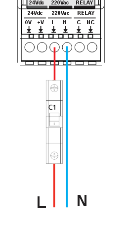
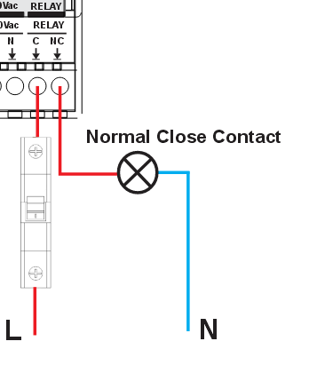

# HomeMaster OpenTherm Gateway


**Part No.:** OpenTherm Gateway-R1 · **Hardware Version:** V1.0 · **Manufacturer:** ISYSTEMS AUTOMATION S.R.L.

## Description

The HomeMaster OpenTherm Gateway is an ESP32-based DIN-rail device designed to interface with OpenTherm-compatible boilers.

The device provides a hardware OpenTherm interface together with one relay output and 1-Wire temperature sensor support. It is designed for local operation using ESPHome and integrates directly with Home Assistant.

This repository includes the full ESPHome configuration used on shipped devices (including vendor OTA update settings).

For complete product documentation (connections, compliance/certifications, wiring, and schematics), see:

- [Product page](https://www.home-master.eu/shop/opentherm-gateway-59)
- [Repository](https://github.com/isystemsautomation/homemaster-dev/tree/main/OpenthermGateway)
- [Datasheet (PDF)](https://github.com/isystemsautomation/homemaster-dev/blob/main/OpenthermGateway/Manuals/OpenTherm_Datasheet.pdf)
- [Maker](https://www.home-master.eu/)

## Table of Contents

- [Description](#description)
- [Features](#features)
- [Electrical and Safety Notes](#electrical-and-safety-notes)
- [Mechanical and Environmental](#mechanical-and-environmental)
- [Installation](#installation)
- [Cable Recommendations & Shield Grounding](#cable-recommendations--shield-grounding)
- [Pinout](#pinout)
- [Terminal Reference](#terminal-reference)
- [LED and Button Behaviour](#led-and-button-behaviour)
- [GPIO Notes](#gpio-notes)
- [Getting Started](#getting-started)
- [Firmware Updates](#firmware-updates)
- [Note on Taking Control in ESPHome](#️-note-on-taking-control-in-esphome)
- [ESPHome Compatibility](#esphome-compatibility)
- [Troubleshooting](#troubleshooting)
- [Compliance & Certifications](#compliance--certifications)
- [1-Wire Bus Note](#1-wire-bus-note)
- [Using Multiple DS18B20 Sensors](#using-multiple-ds18b20-sensors-on-one-bus)
- [Example Entities](#example-entities)
- [Entity Reference](#entity-reference)
- [Default Firmware Configuration](#default-firmware-configuration)
- [License](#license)

## Features

- ESP32-WROOM-32U-N16 (16 MB flash)
- OpenTherm interface (OT+ / OT-)
- Relay output: 1 x SPDT, C and NC contacts accessible, system limit 3 A @ 250 VAC (resistive), 90 W @ 30 VDC
- Two 1-Wire buses
- Power input options: 24 V DC, 85-265 V AC, or 120-370 V DC
- USB Type-C
- Wi-Fi 2.4 GHz (pre-certified radio module) and Bluetooth
- ESPHome pre-installed
- OTA updates (ESPHome + HTTP)
- Improv provisioning
- DIN-rail mounting
- Modular architecture: MCU Board + Field Board

## Electrical and Safety Notes

- Disconnect all power before installation or wiring changes.
- Use only one power input method at a time.
- Relay output is dry-contact and not internally fused.
- Add external overcurrent protection (fuse or breaker) for relay/mains circuits.
- Install inside a control cabinet and protect all terminals from accidental contact.
- L / N terminals carry hazardous mains voltage — installation by qualified personnel only.
- Follow local electrical code and boiler manufacturer OpenTherm wiring requirements.

## Mechanical and Environmental

- Operating temperature: `0 °C` to `+40 °C`
- Storage temperature: `-10 °C` to `+55 °C`
- Relative humidity: `0–90 % RH`, non-condensing
- Protection rating: `IP20` (inside cabinet)
- Dimensions: `35.5 × 90.6 × 67.3 mm` (L × W × H)
- Mounting: `35 mm DIN rail` (2 DIN modules)
- Pack size: `140 × 96 × 95 mm` (L × W × H)

## Installation

### DIN Rail Mounting
- Mount on 35 mm DIN rail. The device occupies 2 DIN modules (≈ 36 mm width).
- Install only inside a ventilated control cabinet.
- The cabinet must include a protective front plate covering all terminals and a closing protective door.
- Not suitable for outdoor or exposed installation.

### Terminal Wiring
- Terminal type: pluggable screw terminal blocks, 5.08 mm pitch.
- Wire cross-section: 0.2–2.5 mm² (AWG 24–12), solid or stranded copper.
- Use ferrules for stranded wire. Tightening torque: 0.4 Nm maximum.
- All wiring terminals must be protected against accidental contact by an insulating front plate, wiring duct, or terminal cover. **Exposed live terminals are not permitted.**

### Power Input
Use only ONE power input method at a time:

| Input | Terminals | Range |
|---|---|---|
| 24 V DC | +V / 0V | 24 V DC nominal |
| AC Mains | L / N | 85–265 V AC |
| Wide DC | L / N | 120–370 V DC |

**24 V DC input:**


**230 V AC input:**



### OpenTherm Bus Wiring
Connect OT+ and OT− between the gateway and the boiler OpenTherm interface.
Keep OT wiring separated from mains and relay output conductors.


### Relay Output Wiring
The relay output exposes **C and NC contacts only** (normally-closed).
System load limits:
- **3 A @ 250 VAC** (resistive, system limit)
- **750 VA @ 250 VAC** maximum
- **90 W @ 30 VDC** maximum

> ⚠️ The relay output is **not internally fused**. Always add an external fuse or circuit breaker. Use an external contactor for loads above 3 A or for inductive / high-inrush loads.



### 1-Wire Sensor Wiring
Two independent 1-Wire channels support DS18B20-compatible temperature sensors.


## Cable Recommendations & Shield Grounding

### General Routing Rules
- Route low-level signal cables (1-Wire / OT) separately from mains, relay output, contactors, and power wiring.
- If crossing power cables is unavoidable, cross at 90°.
- Keep cable runs as short as practical; avoid long parallel runs next to high-current conductors.

### OpenTherm Cable
- Construction: twisted pair.
- Overall shield recommended in cabinets or high-EMI environments.
- Recommended types: `J-Y(ST)Y 2×2×0.5 mm²` or `LI2YCY PiMF 2×2×0.50`.

### 1-Wire Cable
- Recommended: shielded 3-core (+5V / DATA / GND).
- High-EMI or long runs: shielded pairs + overall shield (e.g., `LI2YCY PiMF 2×2×0.50`).
- Topology: **daisy-chain (bus) only** — star wiring is not supported.
- Keep sensor stubs ≤ 0.5 m.
- DATA pull-up: 4.7 kΩ typical; 2.2–3.3 kΩ for long or heavily loaded buses.

### Shield Grounding
- Bond cable shields to cabinet PE/EMC ground at the controller side only (single-end bonding).
- Do not connect shields directly to signal terminals (1-Wire / OT).
- If both ends are in equipotential-bonded cabinets, both-end bonding is permitted using proper 360° clamps.

## Pinout


## Terminal Reference

### Top Terminals (Signal)

| Terminal | Signal | Description |
|---|---|---|
| Gnd | Ground | Common ground reference |
| D1 | 1-Wire Bus 1 DATA | DS18B20-compatible, GPIO4 |
| D2 | 1-Wire Bus 2 DATA | DS18B20-compatible, GPIO5 |
| +5V | +5 V output | Auxiliary 5 V supply for 1-Wire sensors |
| O+ | OpenTherm + | OpenTherm bus positive |
| O- | OpenTherm − | OpenTherm bus negative |

### Bottom Terminals (Power & Relay)

| Terminal | Signal | Description |
|---|---|---|
| 0V | DC Ground | 24 V DC negative / ground |
| +V | DC Power + | 24 V DC positive input |
| L | AC Line / Wide DC + | AC mains live (85–265 V AC) or DC+ (120–370 V DC) |
| N | AC Neutral / Wide DC − | AC mains neutral or DC− |
| C | Relay Common | Dry-contact relay common |
| NC | Relay NC | Normally closed contact |

> ⚠️ Use only ONE power input method at a time (24 V DC or AC/DC L/N).
> L / N terminals carry hazardous mains voltage — qualified personnel only.

## LED and Button Behaviour

### LEDs

The device has 4 LEDs on the front panel: **PWR**, **O.1**, **U.1**, **U.2**.
O.1 reflects the relay output state. U.2 is the ESPHome status LED (GPIO33).
U.1 is user-assignable via ESPHome YAML.

| LED | Behaviour | Meaning |
|---|---|---|
| PWR | Solid ON | Device is powered |
| O.1 | Solid ON | Relay is energised |
| U.1 | Firmware-controlled | Configurable via ESPHome YAML |
| U.2 | Solid ON | Normal operation (Wi-Fi + API connected) |
| U.2 | Fast blink | Wi-Fi connecting or API disconnected |
| U.2 | Blink pattern | OTA update in progress |

> U.2 is configured as the ESPHome `status_led` (GPIO33) and its behaviour
> is controlled by ESPHome firmware. U.1 is a user-assignable LED,
> configurable via ESPHome YAML automations.
> LED colours are not documented here — refer to the physical device or BOM.

### Button (GPIO35)
The physical button is exposed as a binary sensor in ESPHome (`button_1`).
Default behaviour: read-only input — pressing it triggers the `button_1`
binary sensor.
You can add automations in ESPHome or Home Assistant to assign actions
(e.g., restart device, toggle relay).

## GPIO Notes

### GPIO5 — 1-Wire Bus 2 (Strapping Pin)

GPIO5 is an ESP32 strapping pin that must be HIGH at boot. On this device it is
pulled HIGH via a 10 kΩ resistor to 3.3 V through a BSS138 bidirectional
level shifter. The strapping requirement is satisfied at power-on before the
ESP32 initializes — no external pull-up or firmware workaround is needed.

## Getting Started

The device supports two setup methods:

- **Improv Wi-Fi (recommended)**
- **Fallback Access Point (HomeMaster OT Fallback)**

### Improv Wi-Fi Setup (Recommended)

1. Power on the device
2. Open https://improv-wifi.com
3. Connect via USB or Bluetooth
4. Enter Wi-Fi credentials
5. Wait for connection

After connection, the device will appear automatically in:

- ESPHome Dashboard
- Home Assistant

Click **Take Control** to import the full configuration.

### Fallback Access Point (HomeMaster OT Fallback)

If the device cannot connect to Wi-Fi, it starts a fallback Access Point.

**SSID:** `HomeMaster OT Fallback`

#### Steps

1. Power on the device and wait approximately 60 seconds
2. Connect to: HomeMaster OT Fallback
3. Open a browser and navigate to: http://192.168.4.1
4. Enter your Wi-Fi credentials and save

The device will restart and connect to your network.

### Notes

- The captive portal page may open automatically. If it does not, open `http://192.168.4.1` manually.
- Mobile devices may continue using mobile data; disable it if the page does not load.
- The fallback Access Point is only active when the device cannot connect to Wi-Fi.
- Improv Wi-Fi is the preferred setup method.

## Firmware Updates

The device supports two firmware update methods:

### ESPHome Updates (User-controlled)

After taking control in ESPHome Dashboard, firmware can be updated manually:

- Build new firmware from ESPHome
- Upload via OTA or USB
- Full control over configuration

### Managed Updates (HTTP)

The device also supports vendor-provided firmware updates.

A firmware update entity is exposed in Home Assistant, allowing the device to check for new firmware versions and install updates directly.

This mechanism uses the `update.http_request` component with a hosted firmware manifest,
downloading updates over HTTPS directly to the device.

If a newer firmware version is available, it can be installed directly from Home Assistant.

## ⚠️ Note on Taking Control in ESPHome

When you click **Take Control** in ESPHome Dashboard, you import the full
configuration and gain complete control over the firmware.

**Important:** After taking control, vendor-managed OTA updates (via the
Home Assistant firmware update entity) will stop working **unless** you
keep the `http_request`, `ota: platform: http_request`, and `update`
blocks from the original configuration in your customised YAML.

If you remove these blocks, update via ESPHome OTA or USB instead.

## ESPHome Compatibility

- Minimum ESPHome version used and tested: **2026.4.1**

## Troubleshooting

### Device does not appear in Home Assistant or ESPHome Dashboard
- Confirm the device is powered (PWR LED solid ON).
- Confirm Wi-Fi provisioning completed successfully.
- Check that Home Assistant and the device are on the same network/VLAN.
- If O.1 LED is fast-blinking, the device is in Wi-Fi connect mode —
  wait up to 60 seconds.
- If Wi-Fi fails, the device starts the fallback AP
  `HomeMaster OT Fallback` — reconnect and re-enter credentials.

### No OpenTherm communication (all OT entities unavailable)
- Verify O+ and O− wiring. OpenTherm is polarity-sensitive on some boilers.
- Confirm the boiler has an OpenTherm interface enabled in boiler settings.
- Check for short circuits or incorrect voltage on the OT terminals.
- Review ESPHome logs for OpenTherm timeout or CRC errors.

### 1-Wire sensor shows unknown or no value
- Confirm sensor is wired correctly: +5V, DATA (D1 or D2), Gnd.
- If using multiple sensors on one bus, see the section below on
  multiple DS18B20 sensors.
- Keep stubs ≤ 0.5 m and use daisy-chain topology only.
- For long buses consider reducing pull-up resistor to 2.2–3.3 kΩ.

### Relay does not switch
- Check the `Relay` switch entity is enabled in Home Assistant.
- Verify external wiring on C / NC terminals.
- Confirm external fuse or breaker is not tripped.

### Firmware update fails
- Confirm the device has a working internet connection.
- Check update source is reachable:
  `https://isystemsautomation.github.io/homemaster-dev/OpenthermGateway/Firmware/manifest.json`
- If you took control in ESPHome and removed the `http_request` / `update`
  blocks, vendor OTA is no longer available — update via ESPHome OTA instead.

## Compliance & Certifications

The HomeMaster OpenTherm Gateway is CE marked and designed to comply with
applicable EU directives. ISYSTEMS AUTOMATION (HomeMaster brand) maintains
technical documentation and a signed EU Declaration of Conformity (DoC).

### EU Directives
- **EMC** — 2014/30/EU
- **LVD** — 2014/35/EU
- **RED** — 2014/53/EU
- **RoHS** — 2011/65/EU

### Harmonised Standards

| Area | Standard |
|---|---|
| EMC Immunity | EN 61000-6-1 |
| EMC Emissions | EN 61000-6-3 |
| Electrical Safety | EN 62368-1 |
| Radio | EN 300 328 · EN 301 489-1 · EN 301 489-17 |
| RoHS | EN IEC 63000 |

### Radio
The product integrates a pre-certified ESP32 Wi-Fi radio module (2.4 GHz).
Conformity with the Radio Equipment Directive (RED 2014/53/EU) is demonstrated
by the maintained technical documentation and conformity assessment of the complete device.

### Safety Notice
- **L / N terminals** carry hazardous mains voltage — qualified personnel only.
- **24 V DC input** is SELV (Safety Extra-Low Voltage).

## 1-Wire Bus Note

- The provided configuration does not define fixed sensor `address` values.
- For reliable operation, use one sensor per bus (`GPIO4` and `GPIO5`).
- If you need multiple sensors on the same bus, see the section below.

## Using Multiple DS18B20 Sensors on One Bus

By default the configuration works with one sensor per bus and does not
require any address configuration. This is the recommended and simplest setup.

If you need multiple sensors on the same bus, note the following:

- Each DS18B20 has a unique 64-bit ROM address that must be used to
  distinguish sensors on the same bus.
- Sensor addresses are visible in the ESPHome logs at boot — each
  discovered sensor reports its ROM address.
- With multiple sensors per bus, keep each stub ≤ 0.5 m and use
  daisy-chain topology only.
- For guidance on configuring multiple sensors, refer to the
  [ESPHome Dallas Temperature documentation](https://esphome.io/components/sensor/dallas_temp.html).

## Example Entities

The full list of exposed entities is in the [Entity Reference](#entity-reference) table below.
Core enabled entities include: Button, Relay, Boiler Water Temperature, Boiler Flame On,
Boiler Fault Indication, 1-Wire Bus 1 & 2 Temperature, and Firmware Update.

## Entity Reference

| Entity | Type | Default | Description |
|---|---|---|---|
| Button | Binary Sensor | Enabled | Physical button (GPIO35) |
| ESP Status | Binary Sensor | Enabled | Wi-Fi / API connection status |
| Relay | Switch | Enabled | Dry-contact relay output (GPIO32) |
| Boiler CH Enable | Switch | Enabled | Enable central heating |
| Boiler DHW Enable | Switch | Enabled | Enable domestic hot water |
| Boiler CH Setpoint | Number | Enabled | CH flow setpoint 20–80 °C |
| Boiler DHW Setpoint | Number | Enabled | DHW setpoint 35–65 °C |
| Boiler Water Temperature | Sensor | Enabled | Boiler flow temperature |
| Boiler Relative Modulation Level | Sensor | Enabled | Burner modulation % |
| Boiler Flame On | Binary Sensor | Enabled | Flame active |
| Boiler CH Active | Binary Sensor | Enabled | CH mode active |
| Boiler DHW Active | Binary Sensor | Enabled | DHW mode active |
| Boiler Fault Indication | Binary Sensor | Enabled (diagnostic) | Boiler fault flag |
| Boiler Service Request | Binary Sensor | Enabled (diagnostic) | Service due |
| Boiler Lockout Reset | Binary Sensor | Enabled (diagnostic) | Lockout reset flag |
| Boiler Low Water Pressure | Binary Sensor | Enabled (diagnostic) | Low pressure fault |
| Boiler Flame Fault | Binary Sensor | Enabled (diagnostic) | Flame sensor fault |
| Boiler Air Pressure Fault | Binary Sensor | Enabled (diagnostic) | Air pressure fault |
| Boiler Water Overtemperature | Binary Sensor | Enabled (diagnostic) | Overtemperature fault |
| Boiler DHW Setpoint Transfer Enabled | Binary Sensor | Enabled (diagnostic) | DHW setpoint transfer capability |
| Boiler Max CH Setpoint Transfer Enabled | Binary Sensor | Enabled (diagnostic) | Max CH setpoint transfer capability |
| Boiler DHW Setpoint RW | Binary Sensor | Enabled (diagnostic) | DHW setpoint read/write capability |
| Boiler Max CH Setpoint RW | Binary Sensor | Enabled (diagnostic) | Max CH setpoint read/write capability |
| 1-Wire Bus 1 Temperature | Sensor | Enabled | GPIO4 temperature sensor |
| 1-Wire Bus 2 Temperature | Sensor | Enabled | GPIO5 temperature sensor |
| Firmware Update | Update | Enabled | Vendor OTA update entity |
| WiFi Signal | Sensor | Enabled (diagnostic) | RSSI in dBm |
| ESP IP Address | Text Sensor | Enabled (diagnostic) | Device IP address |
| ESPHome Version | Text Sensor | Enabled (diagnostic) | Running ESPHome version |
| ESP Uptime Human | Text Sensor | Enabled (diagnostic) | Human-readable uptime |
| ESP32 Temperature | Sensor | Enabled (diagnostic) | Internal chip temperature |
| Boiler Return Temperature | Sensor | **Disabled** | Requires boiler support |
| Boiler DHW Temperature | Sensor | **Disabled** | Requires boiler support |
| Boiler Outside Temperature | Sensor | **Disabled** | Requires boiler support |
| Boiler CH Pressure | Sensor | **Disabled** | Requires boiler support |
| Boiler DHW Flow Rate | Sensor | **Disabled** | Requires boiler support |
| Boiler Storage Temperature | Sensor | **Disabled** | Requires boiler support |
| Boiler Collector Temperature | Sensor | **Disabled** | Requires boiler support |
| Boiler CH2 Flow Temperature | Sensor | **Disabled** | Requires boiler support |
| Boiler DHW2 Temperature | Sensor | **Disabled** | Requires boiler support |
| Boiler Exhaust Temperature | Sensor | **Disabled** | Requires boiler support |
| Boiler Max CH Setpoint | Number | **Disabled** | Requires boiler support |
| Boiler Max Relative Modulation | Number | **Disabled** | Requires boiler support |
| Boiler OTC Heat Curve Ratio | Number | **Disabled** | Requires boiler support |
| Boiler Cooling Enable | Switch | **Disabled** | Requires boiler support |
| Boiler OTC Active | Switch | **Disabled** | Requires boiler support |
| Boiler CH2 Active | Switch | **Disabled** | Requires boiler support |
| Boiler Summer Mode Active | Switch | **Disabled** | Requires boiler support |
| Boiler DHW Block | Switch | **Disabled** | Requires boiler support |
| Boiler Diagnostic Indication | Binary Sensor | **Disabled** | Extended diagnostic |

## Default Firmware Configuration

```yaml
esphome:
  name: homemaster-opentherm
  name_add_mac_suffix: true
  friendly_name: HomeMaster OpenTherm Gateway
  project:
    name: homemaster.opentherm_gateway
    version: "1.0.6"

esp32:
  variant: esp32
  board: esp32dev
  flash_size: 16MB
  framework:
    type: esp-idf

logger:

api:

wifi:
  ap:
    ssid: "HomeMaster OT Fallback"
  on_connect:
    then:
      - delay: 10s
      - component.update: firmware_update

captive_portal:

esp32_improv:
  authorizer: none

improv_serial:

dashboard_import:
  package_import_url: github://isystemsautomation/homemaster-dev/OpenthermGateway/Firmware/opentherm.yaml@main
  import_full_config: true

http_request:

ota:
  - platform: esphome
  - platform: http_request

update:
  - platform: http_request
    id: firmware_update
    name: "Firmware Update"
    source: https://isystemsautomation.github.io/homemaster-dev/OpenthermGateway/Firmware/manifest.json
    update_interval: 6h

opentherm:
  id: ot_bus
  in_pin: GPIO21
  out_pin: GPIO26

binary_sensor:
  - platform: status
    id: esp_status
    name: "ESP Status"
    entity_category: diagnostic

  - platform: gpio
    id: button_1
    name: "Button"
    pin:
      number: GPIO35
      inverted: true
      mode:
        input: true

  - platform: opentherm
    # Core (minimum) set: IDs 0, 5, 6.
    fault_indication:
      id: ot_fault_indication
      name: "Boiler Fault Indication"
      entity_category: diagnostic
    flame_on:
      id: ot_flame_on
      name: "Boiler Flame On"
    ch_active:
      id: ot_ch_active
      name: "Boiler CH Active"
    dhw_active:
      id: ot_dhw_active
      name: "Boiler DHW Active"
    service_request:
      id: ot_service_request
      name: "Boiler Service Request"
      entity_category: diagnostic
    lockout_reset:
      id: ot_lockout_reset
      name: "Boiler Lockout Reset"
      entity_category: diagnostic
    low_water_pressure:
      id: ot_low_water_pressure
      name: "Boiler Low Water Pressure"
      entity_category: diagnostic
    flame_fault:
      id: ot_flame_fault
      name: "Boiler Flame Fault"
      entity_category: diagnostic
    air_pressure_fault:
      id: ot_air_pressure_fault
      name: "Boiler Air Pressure Fault"
      entity_category: diagnostic
    water_over_temp:
      id: ot_water_over_temp
      name: "Boiler Water Overtemperature"
      entity_category: diagnostic
    dhw_setpoint_transfer_enabled:
      id: ot_dhw_setpoint_transfer_enabled
      name: "Boiler DHW Setpoint Transfer Enabled"
      entity_category: diagnostic
    max_ch_setpoint_transfer_enabled:
      id: ot_max_ch_setpoint_transfer_enabled
      name: "Boiler Max CH Setpoint Transfer Enabled"
      entity_category: diagnostic
    dhw_setpoint_rw:
      id: ot_dhw_setpoint_rw
      name: "Boiler DHW Setpoint RW"
      entity_category: diagnostic
    max_ch_setpoint_rw:
      id: ot_max_ch_setpoint_rw
      name: "Boiler Max CH Setpoint RW"
      entity_category: diagnostic

    # Extended set (model-dependent). Disabled by default.
    diagnostic_indication:
      id: ot_diagnostic_indication
      name: "Boiler Diagnostic Indication"
      entity_category: diagnostic
      disabled_by_default: true

one_wire:
  - platform: gpio
    id: ow_bus_1
    pin: GPIO4

  - platform: gpio
    id: ow_bus_2
    pin: GPIO5

sensor:
  - platform: uptime
    id: esp_uptime
    internal: true
    update_interval: 60s

  - platform: wifi_signal
    id: wifi_signal_db
    name: "WiFi Signal"
    update_interval: 60s
    entity_category: diagnostic

  - platform: internal_temperature
    id: esp32_temperature
    name: "ESP32 Temperature"
    update_interval: 60s
    entity_category: diagnostic

  - platform: opentherm
    # Core (minimum) set: IDs 17, 24.
    t_boiler:
      id: ot_t_boiler
      name: "Boiler Water Temperature"
      unit_of_measurement: "°C"
    rel_mod_level:
      id: ot_rel_mod_level
      name: "Boiler Relative Modulation Level"
      unit_of_measurement: "%"

    # Extended set (model-dependent). Disabled by default.
    t_ret:
      id: ot_t_ret
      name: "Boiler Return Temperature"
      unit_of_measurement: "°C"
      disabled_by_default: true
    t_dhw:
      id: ot_t_dhw
      name: "Boiler DHW Temperature"
      unit_of_measurement: "°C"
      disabled_by_default: true
    t_outside:
      id: ot_t_outside
      name: "Boiler Outside Temperature"
      unit_of_measurement: "°C"
      disabled_by_default: true
    ch_pressure:
      id: ot_ch_pressure
      name: "Boiler CH Pressure"
      unit_of_measurement: "bar"
      disabled_by_default: true
    dhw_flow_rate:
      id: ot_dhw_flow_rate
      name: "Boiler DHW Flow Rate"
      unit_of_measurement: "l/min"
      disabled_by_default: true
    t_storage:
      id: ot_t_storage
      name: "Boiler Storage Temperature"
      unit_of_measurement: "°C"
      disabled_by_default: true
    t_collector:
      id: ot_t_collector
      name: "Boiler Collector Temperature"
      unit_of_measurement: "°C"
      disabled_by_default: true
    t_flow_ch2:
      id: ot_t_flow_ch2
      name: "Boiler CH2 Flow Temperature"
      unit_of_measurement: "°C"
      disabled_by_default: true
    t_dhw2:
      id: ot_t_dhw2
      name: "Boiler DHW2 Temperature"
      unit_of_measurement: "°C"
      disabled_by_default: true
    t_exhaust:
      id: ot_t_exhaust
      name: "Boiler Exhaust Temperature"
      unit_of_measurement: "°C"
      disabled_by_default: true

  - platform: dallas_temp
    id: ow_bus_1_temperature
    one_wire_id: ow_bus_1
    name: "1-Wire Bus 1 Temperature"
    unit_of_measurement: "°C"

  - platform: dallas_temp
    id: ow_bus_2_temperature
    one_wire_id: ow_bus_2
    name: "1-Wire Bus 2 Temperature"
    unit_of_measurement: "°C"

switch:
  - platform: opentherm
    # Core control (ID 0).
    ch_enable:
      id: ot_ch_enable
      name: "Boiler CH Enable"
      restore_mode: RESTORE_DEFAULT_ON
    dhw_enable:
      id: ot_dhw_enable
      name: "Boiler DHW Enable"
      restore_mode: RESTORE_DEFAULT_ON
    # Extended control (model-dependent). Disabled by default.
    cooling_enable:
      id: ot_cooling_enable
      name: "Boiler Cooling Enable"
      disabled_by_default: true
    otc_active:
      id: ot_otc_active
      name: "Boiler OTC Active"
      disabled_by_default: true
    ch2_active:
      id: ot_ch2_active
      name: "Boiler CH2 Active"
      disabled_by_default: true
    summer_mode_active:
      id: ot_summer_mode_active
      name: "Boiler Summer Mode Active"
      disabled_by_default: true
    dhw_block:
      id: ot_dhw_block
      name: "Boiler DHW Block"
      disabled_by_default: true

  - platform: gpio
    id: relay_1
    name: "Relay"
    pin: GPIO32

number:
  - platform: opentherm
    # Core (minimum) set: IDs 1, 56.
    t_set:
      id: ot_t_set
      name: "Boiler CH Setpoint"
      min_value: 20
      max_value: 80
      step: 1
    t_dhw_set:
      id: ot_t_dhw_set
      name: "Boiler DHW Setpoint"
      min_value: 35
      max_value: 65
      step: 1

    # Extended controls (model-dependent). Disabled by default.
    max_t_set:
      id: ot_max_t_set
      name: "Boiler Max CH Setpoint"
      min_value: 30
      max_value: 85
      step: 1
      disabled_by_default: true
    max_rel_mod_level:
      id: ot_max_rel_mod_level
      name: "Boiler Max Relative Modulation Level"
      min_value: 0
      max_value: 100
      step: 1
      disabled_by_default: true
    otc_hc_ratio:
      id: ot_otc_hc_ratio
      name: "Boiler OTC Heat Curve Ratio"
      min_value: 0
      max_value: 127
      step: 1
      disabled_by_default: true

text_sensor:
  - platform: template
    id: esp_uptime_human
    name: "ESP Uptime Human"
    entity_category: diagnostic
    update_interval: 60s
    lambda: |-
      if (isnan(id(esp_uptime).state)) {
        return {};
      }
      int total_seconds = (int) id(esp_uptime).state;
      int days = total_seconds / 86400;
      int hours = (total_seconds % 86400) / 3600;
      if (days > 0) {
        return {to_string(days) + "d " + to_string(hours) + "h"};
      }
      int minutes = (total_seconds % 3600) / 60;
      if (hours > 0) {
        return {to_string(hours) + "h " + to_string(minutes) + "m"};
      }
      return {to_string(minutes) + "m"};

  - platform: version
    name: "ESPHome Version"
    entity_category: diagnostic

  - platform: wifi_info
    ip_address:
      name: "ESP IP Address"
      entity_category: diagnostic

status_led:
  pin:
    number: GPIO33
    inverted: true
```

## License

This project uses a hybrid licensing model.

### Hardware
Hardware designs (schematics, PCB layouts, BOMs) are licensed under **CERN-OHL-W v2**.

### Firmware & ESPHome Integration
All firmware, ESPHome configurations, and software components are licensed under the **MIT License**.

This ensures full compatibility with ESPHome and Home Assistant while protecting hardware designs.
See LICENSE files in each directory for full terms.
