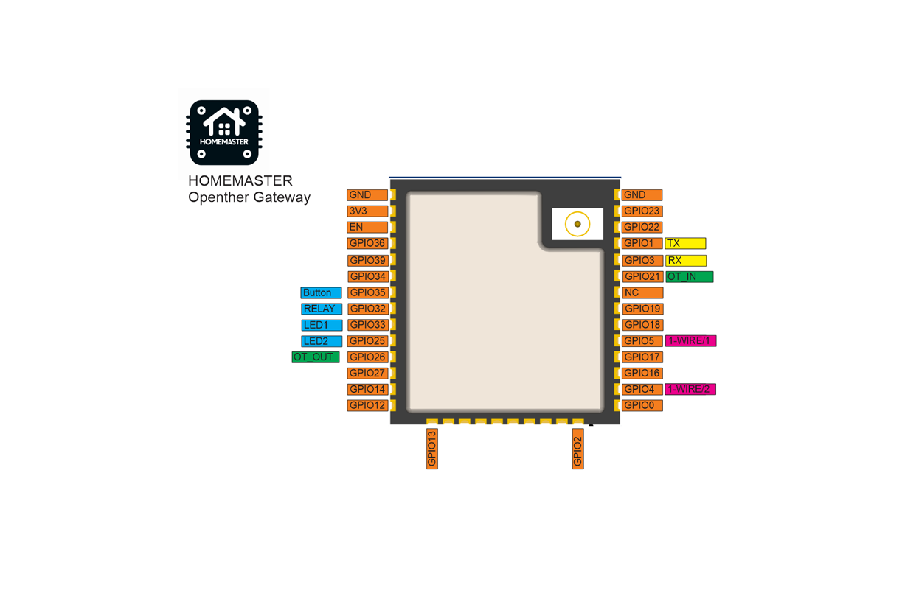

## HomeMaster OpenTherm Gateway


## Description

The HomeMaster OpenTherm Gateway is an ESP32-based DIN-rail device designed to interface with OpenTherm-compatible boilers.

The device provides a hardware OpenTherm interface together with one relay output and 1-Wire temperature sensor support. It is designed for local operation using ESPHome and integrates directly with Home Assistant.

This page includes the full ESPHome configuration used on shipped devices (including vendor OTA update settings).

For complete product documentation (connections, compliance/certifications, wiring, and schematics), see:

- Product page: https://www.home-master.eu/shop/opentherm-gateway-59
- Repository: https://github.com/isystemsautomation/homemaster-dev/tree/main/OpenthermGateway
- Datasheet (PDF): https://github.com/isystemsautomation/homemaster-dev/blob/main/OpenthermGateway/Manuals/OpenTherm_Datasheet.pdf

- Maker: https://www.home-master.eu/

## Features

- ESP32-WROOM-32U-N16 (16 MB flash)
- OpenTherm interface (OT+ / OT-)
- Relay channels: 1 x SPDT dry-contact, system limit 3 A @ 250 VAC (resistive), 90 W @ 30 VDC
- Two 1-Wire buses
- Power input options: 24 V DC, 85-265 V AC, or 120-370 V DC
- USB Type-C
- Wi-Fi and Bluetooth
- ESPHome pre-installed
- OTA updates (ESPHome + HTTP)
- Improv provisioning
- DIN-rail mounting

## Electrical and Safety Notes

- Use only one power input method at a time.
- Relay output is dry-contact and not internally fused.
- Add external overcurrent protection (fuse or breaker) for relay/mains circuits.
- Install inside a control cabinet and protect all terminals from accidental contact.

## Mechanical and Environmental

- Operating temperature: `0 °C` to `+40 °C`
- Storage temperature: `-10 °C` to `+55 °C`
- Protection rating: `IP20` (inside cabinet)
- Dimensions: `35.5 x 90.6 x 67.3 mm` (L x W x H)
- Mounting: `35 mm DIN rail` (2 DIN modules)

## Installation

### DIN Rail Mounting
- Mount on 35 mm DIN rail. The device occupies 2 DIN modules (≈ 36 mm width).
- Install only inside a ventilated control cabinet.
- The cabinet must include a protective front plate covering all terminals and a closing protective door.
- Not suitable for outdoor or exposed installation.

### Terminal Wiring
- Terminal type: pluggable screw terminal blocks, 5.08 mm pitch.
- Wire cross-section: 0.2–2.5 mm² (AWG 24–12), solid or stranded copper.
- Use ferrules for stranded wire. Tightening torque: 0.4 Nm maximum.
- All wiring terminals must be protected against accidental contact by an insulating front plate, wiring duct, or terminal cover. **Exposed live terminals are not permitted.**

### Power Input
Use only ONE power input method at a time:

| Input | Terminals | Range |
|---|---|---|
| 24 V DC | V+ / 0V | 24 V DC nominal |
| AC Mains | L / N | 85–265 V AC |
| Wide DC | L / N | 120–370 V DC |

Wiring diagrams:
- 24 V DC: 
- 230 V AC: 

### OpenTherm Bus Wiring
Connect OT+ and OT− between the gateway and the boiler OpenTherm interface.
Keep OT wiring separated from mains and relay output conductors.


### Relay Output Wiring
The relay output is dry-contact (SPDT). System load limits:
- **3 A @ 250 VAC** (resistive, system limit)
- **750 VA @ 250 VAC** maximum
- **90 W @ 30 VDC** maximum

> ⚠️ The relay output is **not internally fused**. Always add an external fuse or circuit breaker. Use an external contactor for loads above 3 A or for inductive / high-inrush loads.


### 1-Wire Sensor Wiring
Two independent 1-Wire channels support DS18B20-compatible temperature sensors.


## Cable Recommendations & Shield Grounding

### General Routing Rules
- Route low-level signal cables (1-Wire / OT) separately from mains, relay output, contactors, and power wiring.
- If crossing power cables is unavoidable, cross at 90°.
- Keep cable runs as short as practical; avoid long parallel runs next to high-current conductors.

### OpenTherm Cable
- Construction: twisted pair.
- Overall shield recommended in cabinets or high-EMI environments.
- Recommended types: `J-Y(ST)Y 2×2×0.5 mm²` or `LI2YCY PiMF 2×2×0.50`.

### 1-Wire Cable
- Recommended: shielded 3-core (+5V / DATA / GND).
- High-EMI or long runs: shielded pairs + overall shield (e.g., `LI2YCY PiMF 2×2×0.50`).
- Topology: **daisy-chain (bus) only** — star wiring is not supported.
- Keep sensor stubs ≤ 0.5 m.
- DATA pull-up: 4.7 kΩ typical; 2.2–3.3 kΩ for long or heavily loaded buses.

### Shield Grounding
- Bond cable shields to cabinet PE/EMC ground at the controller side only (single-end bonding).
- Do not connect shields directly to signal terminals (1-Wire / OT).
- If both ends are in equipotential-bonded cabinets, both-end bonding is permitted using proper 360° clamps.

## Pinout



## Terminal Reference

| Terminal Label | Signal | Description |
|---|---|---|
| GND | Ground | Common ground reference |
| D1 | Digital Input 1 | Reserved / not populated on this model |
| D2 | Digital Input 2 | Reserved / not populated on this model |
| +5V | +5 V output | Auxiliary 5 V for 1-Wire sensors |
| OT+ | OpenTherm + | OpenTherm bus positive |
| OT- | OpenTherm − | OpenTherm bus negative |
| 1-WIRE 1 | 1-Wire Bus 1 | DS18B20-compatible, GPIO4 |
| 1-WIRE 2 | 1-Wire Bus 2 | DS18B20-compatible, GPIO5 |
| 24Vdc V+ | DC Power + | 24 V DC positive input |
| 24Vdc 0V | DC Power − | 24 V DC negative / ground |
| 220Vac L | AC Line | AC mains live (85–265 V AC) |
| 220Vac N | AC Neutral | AC mains neutral |
| RELAY C | Relay Common | Dry-contact relay common |
| RELAY NC | Relay NC | Normally closed contact |
| RELAY NO | Relay NO | Normally open contact |

> For the full pinout diagram see the image above.

## GPIO Notes

### GPIO5 — 1-Wire Bus 2 (Strapping Pin)

GPIO5 is an ESP32 strapping pin that must be HIGH at boot. On this device it is
pulled HIGH via a 10 kΩ resistor to 3.3 V through a BSS138 bidirectional
level shifter. The strapping requirement is satisfied at power-on before the
ESP32 initializes — no external pull-up or firmware workaround is needed.

## LED and Button Behaviour

### LEDs

| LED | Colour | Behaviour | Meaning |
|---|---|---|---|
| PWR | Green | Solid ON | Device is powered |
| Status | Blue | Slow blink | Normal operation / Wi-Fi connected |
| Status | Blue | Fast blink | Wi-Fi connecting / fallback AP active |
| Relay state | Yellow | Solid ON | Relay is energised (NO contact closed) |
| User LED | Red | Firmware-controlled | Configurable via ESPHome |

> LED behaviour for Status and User LED can be customised in ESPHome YAML.

### Button (GPIO35)
The physical button is exposed as a binary sensor in ESPHome (`button_1`).
Default behaviour: read-only input — pressing it triggers the `button_1` binary sensor.
You can add automations in ESPHome or Home Assistant to assign actions (e.g., restart, toggle relay).

## Getting Started

The device supports two setup methods:

- **Improv Wi-Fi (recommended)**
- **Fallback Access Point (HomeMaster OT Fallback)**

### Improv Wi-Fi Setup (Recommended)

1. Power on the device
2. Open https://improv-wifi.com
3. Connect via USB or Bluetooth
4. Enter Wi-Fi credentials
5. Wait for connection

After connection, the device will appear automatically in:

- ESPHome Dashboard
- Home Assistant

Click **Take Control** to import the full configuration.

### Fallback Access Point (HomeMaster OT Fallback)

If the device cannot connect to Wi-Fi, it starts a fallback Access Point.

**SSID:** `HomeMaster OT Fallback`

#### Steps

1. Power on the device and wait approximately 60 seconds
2. Connect to: HomeMaster OT Fallback
3. Open a browser and navigate to: http://192.168.4.1
4. Enter your Wi-Fi credentials and save

The device will restart and connect to your network.

### Notes

- The captive portal page may open automatically. If it does not, open `http://192.168.4.1` manually.
- Mobile devices may continue using mobile data; disable it if the page does not load.
- The fallback Access Point is only active when the device cannot connect to Wi-Fi.
- Improv Wi-Fi is the preferred setup method.

## Firmware Updates

The device supports two firmware update methods:

### ESPHome Updates (User-controlled)

After taking control in ESPHome Dashboard, firmware can be updated manually:

- Build new firmware from ESPHome
- Upload via OTA or USB
- Full control over configuration

### Managed Updates (HTTP)

The device also supports vendor-provided firmware updates.

A firmware update entity is exposed in Home Assistant, allowing the device to check for new firmware versions and install updates directly.

This mechanism uses:

- `update.http_request`
- a hosted firmware manifest
- OTA firmware downloads over HTTPS

If a newer firmware version is available, it can be installed directly from Home Assistant.

## ESPHome Compatibility

- Minimum ESPHome version used and tested: **2026.4.1**

## 1-Wire Bus Note

- In the provided configuration, the 1-Wire buses do not define fixed sensor `address` values.
- With this setup, use one sensor per bus (`GPIO4` and `GPIO5`) for predictable operation.
- If you connect multiple sensors on the same bus, you must set each sensor `address` explicitly in YAML.

## Using Multiple DS18B20 Sensors on One Bus

By default, the configuration does not specify sensor addresses. This works reliably when one sensor is connected per bus.

If you need multiple sensors on the same bus, you must assign each sensor a fixed address:

### Step 1 — Find sensor addresses
Add a temporary logger to your YAML and check the ESPHome logs after boot. Each DS18B20 reports its unique 64-bit ROM address on startup, e.g.:

## Example Entities

The example configuration below exposes:

- Button
- Relay
- Status LED
- Boiler Water Temperature
- Boiler Flame On
- Boiler Fault Indication
- 1-Wire Bus 1 Temperature
- 1-Wire Bus 2 Temperature
- Firmware Update

Additional OpenTherm entities are available in the full configuration.

## Full ESPHome Configuration (Shipped Device)

```yaml
esphome:
  name: homemaster-opentherm
  name_add_mac_suffix: true
  friendly_name: HomeMaster OpenTherm Gateway
  project:
    name: homemaster.opentherm_gateway
    version: "1.0.6"

esp32:
  variant: esp32
  board: esp32dev
  flash_size: 16MB
  framework:
    type: esp-idf

logger:

api:

wifi:
  ap:
    ssid: "HomeMaster OT Fallback"
  on_connect:
    then:
      - delay: 10s
      - component.update: firmware_update

captive_portal:

esp32_improv:
  authorizer: none

improv_serial:

dashboard_import:
  package_import_url: github://isystemsautomation/homemaster-dev/OpenthermGateway/Firmware/opentherm.yaml@main
  import_full_config: true

http_request:

ota:
  - platform: esphome
  - platform: http_request

update:
  - platform: http_request
    id: firmware_update
    name: "Firmware Update"
    source: https://isystemsautomation.github.io/homemaster-dev/OpenthermGateway/Firmware/manifest.json
    update_interval: 6h

opentherm:
  id: ot_bus
  in_pin: GPIO21
  out_pin: GPIO26

binary_sensor:
  - platform: status
    id: esp_status
    name: "ESP Status"
    entity_category: diagnostic

  - platform: gpio
    id: button_1
    name: "Button"
    pin:
      number: GPIO35
      inverted: true
      mode:
        input: true

  - platform: opentherm
    # Core (minimum) set: IDs 0, 5, 6.
    fault_indication:
      id: ot_fault_indication
      name: "Boiler Fault Indication"
      entity_category: diagnostic
    flame_on:
      id: ot_flame_on
      name: "Boiler Flame On"
    ch_active:
      id: ot_ch_active
      name: "Boiler CH Active"
    dhw_active:
      id: ot_dhw_active
      name: "Boiler DHW Active"
    service_request:
      id: ot_service_request
      name: "Boiler Service Request"
      entity_category: diagnostic
    lockout_reset:
      id: ot_lockout_reset
      name: "Boiler Lockout Reset"
      entity_category: diagnostic
    low_water_pressure:
      id: ot_low_water_pressure
      name: "Boiler Low Water Pressure"
      entity_category: diagnostic
    flame_fault:
      id: ot_flame_fault
      name: "Boiler Flame Fault"
      entity_category: diagnostic
    air_pressure_fault:
      id: ot_air_pressure_fault
      name: "Boiler Air Pressure Fault"
      entity_category: diagnostic
    water_over_temp:
      id: ot_water_over_temp
      name: "Boiler Water Overtemperature"
      entity_category: diagnostic
    dhw_setpoint_transfer_enabled:
      id: ot_dhw_setpoint_transfer_enabled
      name: "Boiler DHW Setpoint Transfer Enabled"
      entity_category: diagnostic
    max_ch_setpoint_transfer_enabled:
      id: ot_max_ch_setpoint_transfer_enabled
      name: "Boiler Max CH Setpoint Transfer Enabled"
      entity_category: diagnostic
    dhw_setpoint_rw:
      id: ot_dhw_setpoint_rw
      name: "Boiler DHW Setpoint RW"
      entity_category: diagnostic
    max_ch_setpoint_rw:
      id: ot_max_ch_setpoint_rw
      name: "Boiler Max CH Setpoint RW"
      entity_category: diagnostic

    # Extended set (model-dependent). Disabled by default.
    diagnostic_indication:
      id: ot_diagnostic_indication
      name: "Boiler Diagnostic Indication"
      entity_category: diagnostic
      disabled_by_default: true

one_wire:
  - platform: gpio
    id: ow_bus_1
    pin: GPIO4

  - platform: gpio
    id: ow_bus_2
    pin: GPIO5

sensor:
  - platform: uptime
    id: esp_uptime
    internal: true
    update_interval: 60s

  - platform: wifi_signal
    id: wifi_signal_db
    name: "WiFi Signal"
    update_interval: 60s
    entity_category: diagnostic

  - platform: internal_temperature
    id: esp32_temperature
    name: "ESP32 Temperature"
    update_interval: 60s
    entity_category: diagnostic

  - platform: opentherm
    # Core (minimum) set: IDs 17, 24.
    t_boiler:
      id: ot_t_boiler
      name: "Boiler Water Temperature"
      unit_of_measurement: "°C"
    rel_mod_level:
      id: ot_rel_mod_level
      name: "Boiler Relative Modulation Level"
      unit_of_measurement: "%"

    # Extended set (model-dependent). Disabled by default.
    t_ret:
      id: ot_t_ret
      name: "Boiler Return Temperature"
      unit_of_measurement: "°C"
      disabled_by_default: true
    t_dhw:
      id: ot_t_dhw
      name: "Boiler DHW Temperature"
      unit_of_measurement: "°C"
      disabled_by_default: true
    t_outside:
      id: ot_t_outside
      name: "Boiler Outside Temperature"
      unit_of_measurement: "°C"
      disabled_by_default: true
    ch_pressure:
      id: ot_ch_pressure
      name: "Boiler CH Pressure"
      unit_of_measurement: "bar"
      disabled_by_default: true
    dhw_flow_rate:
      id: ot_dhw_flow_rate
      name: "Boiler DHW Flow Rate"
      unit_of_measurement: "l/min"
      disabled_by_default: true
    t_storage:
      id: ot_t_storage
      name: "Boiler Storage Temperature"
      unit_of_measurement: "°C"
      disabled_by_default: true
    t_collector:
      id: ot_t_collector
      name: "Boiler Collector Temperature"
      unit_of_measurement: "°C"
      disabled_by_default: true
    t_flow_ch2:
      id: ot_t_flow_ch2
      name: "Boiler CH2 Flow Temperature"
      unit_of_measurement: "°C"
      disabled_by_default: true
    t_dhw2:
      id: ot_t_dhw2
      name: "Boiler DHW2 Temperature"
      unit_of_measurement: "°C"
      disabled_by_default: true
    t_exhaust:
      id: ot_t_exhaust
      name: "Boiler Exhaust Temperature"
      unit_of_measurement: "°C"
      disabled_by_default: true

  - platform: dallas_temp
    id: ow_bus_1_temperature
    one_wire_id: ow_bus_1
    name: "1-Wire Bus 1 Temperature"
    unit_of_measurement: "°C"

  - platform: dallas_temp
    id: ow_bus_2_temperature
    one_wire_id: ow_bus_2
    name: "1-Wire Bus 2 Temperature"
    unit_of_measurement: "°C"

switch:
  - platform: opentherm
    # Core control (ID 0).
    ch_enable:
      id: ot_ch_enable
      name: "Boiler CH Enable"
      restore_mode: RESTORE_DEFAULT_ON
    dhw_enable:
      id: ot_dhw_enable
      name: "Boiler DHW Enable"
      restore_mode: RESTORE_DEFAULT_ON
    # Extended control (model-dependent). Disabled by default.
    cooling_enable:
      id: ot_cooling_enable
      name: "Boiler Cooling Enable"
      disabled_by_default: true
    otc_active:
      id: ot_otc_active
      name: "Boiler OTC Active"
      disabled_by_default: true
    ch2_active:
      id: ot_ch2_active
      name: "Boiler CH2 Active"
      disabled_by_default: true
    summer_mode_active:
      id: ot_summer_mode_active
      name: "Boiler Summer Mode Active"
      disabled_by_default: true
    dhw_block:
      id: ot_dhw_block
      name: "Boiler DHW Block"
      disabled_by_default: true

  - platform: gpio
    id: relay_1
    name: "Relay"
    pin: GPIO32

number:
  - platform: opentherm
    # Core (minimum) set: IDs 1, 56.
    t_set:
      id: ot_t_set
      name: "Boiler CH Setpoint"
      min_value: 20
      max_value: 80
      step: 1
    t_dhw_set:
      id: ot_t_dhw_set
      name: "Boiler DHW Setpoint"
      min_value: 35
      max_value: 65
      step: 1

    # Extended controls (model-dependent). Disabled by default.
    max_t_set:
      id: ot_max_t_set
      name: "Boiler Max CH Setpoint"
      min_value: 30
      max_value: 85
      step: 1
      disabled_by_default: true
    max_rel_mod_level:
      id: ot_max_rel_mod_level
      name: "Boiler Max Relative Modulation Level"
      min_value: 0
      max_value: 100
      step: 1
      disabled_by_default: true
    otc_hc_ratio:
      id: ot_otc_hc_ratio
      name: "Boiler OTC Heat Curve Ratio"
      min_value: 0
      max_value: 127
      step: 1
      disabled_by_default: true

text_sensor:
  - platform: template
    id: esp_uptime_human
    name: "ESP Uptime Human"
    entity_category: diagnostic
    update_interval: 60s
    lambda: |-
      if (isnan(id(esp_uptime).state)) {
        return {};
      }
      int total_seconds = (int) id(esp_uptime).state;
      int days = total_seconds / 86400;
      int hours = (total_seconds % 86400) / 3600;
      if (days > 0) {
        return {to_string(days) + "d " + to_string(hours) + "h"};
      }
      int minutes = (total_seconds % 3600) / 60;
      if (hours > 0) {
        return {to_string(hours) + "h " + to_string(minutes) + "m"};
      }
      return {to_string(minutes) + "m"};

  - platform: version
    name: "ESPHome Version"
    entity_category: diagnostic

  - platform: wifi_info
    ip_address:
      name: "ESP IP Address"
      entity_category: diagnostic

status_led:
  pin:
    number: GPIO33
    inverted: true
```

## License

This project uses a hybrid licensing model.

### Hardware
Hardware designs (schematics, PCB layouts, BOMs) are licensed under **CERN-OHL-W v2**.

### Firmware & ESPHome Integration
All firmware, ESPHome configurations, and software components are licensed under the **MIT License**.

This ensures full compatibility with ESPHome and Home Assistant while protecting hardware designs.
See LICENSE files in each directory for full terms.
