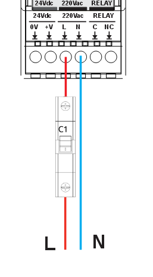
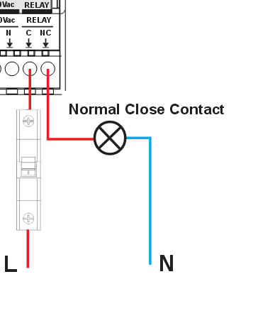
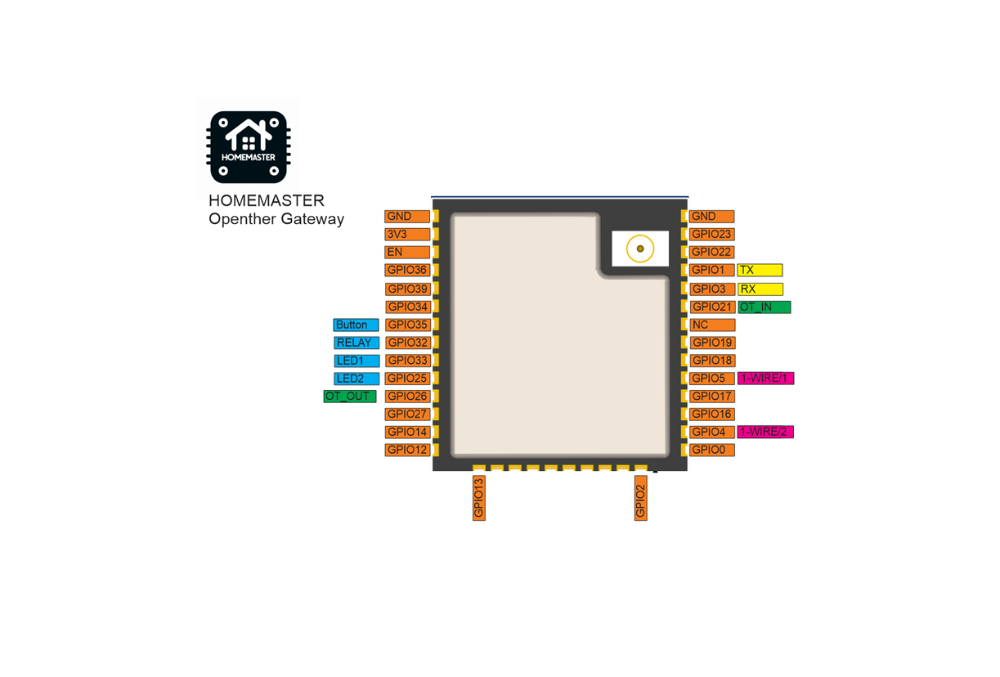
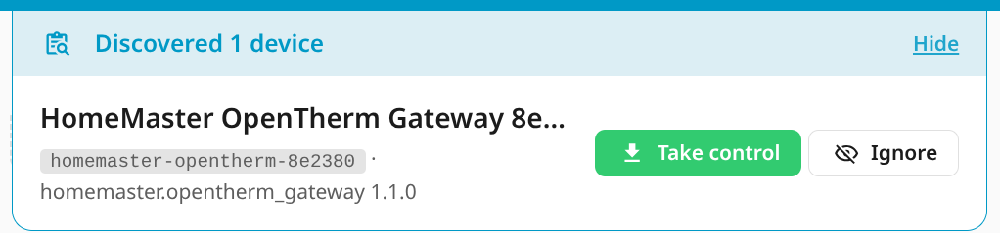
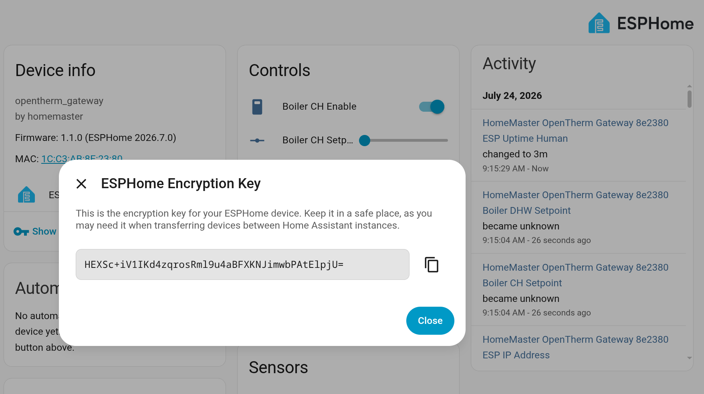
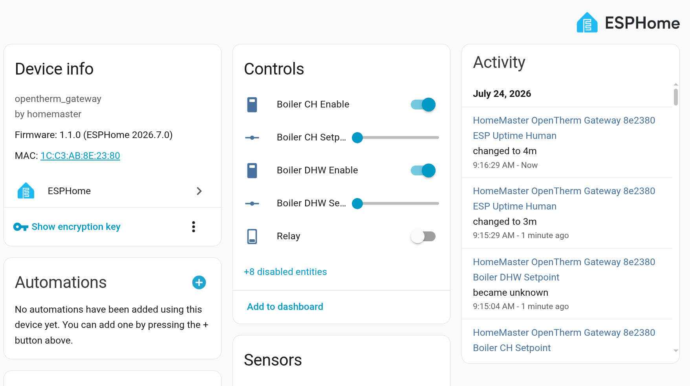

# HomeMaster OpenTherm Gateway

<a href="https://devices.esphome.io/devices/homemaster-openthermgateway/"></a>


**Part No.:** OTGW-R1 · **Hardware Version:** V1.0 · **Manufacturer:** ISYSTEMS AUTOMATION S.R.L.

## Description

The HomeMaster OpenTherm Gateway is an ESP32 **OpenTherm master** (not a Modbus slave) for OpenTherm®-compatible boilers. It exposes full boiler telemetry and modulating / weather-compensated control in Home Assistant via pre-installed ESPHome, with a dry-contact relay and two 1-Wire buses for local temperature sensing.

The device initiates all OpenTherm communication with the boiler (boiler must be OpenTherm slave — standard for OT-capable boilers). If no boiler is connected, OpenTherm entities are unavailable but the relay and 1-Wire functions continue to operate. Observe the relay **cross-mains** restriction on hardware rev V1.0 (see Wiring).

This repository includes the full ESPHome configuration used on shipped devices (including vendor OTA update settings).

## Key advantages

- ESP32 **OpenTherm master** (not a Modbus slave) exposing full boiler telemetry — modulation, flame, temperatures, faults — in Home Assistant, with modulating / weather-compensated heating.
- Includes a dry-contact **relay** (observe the cross-mains restriction on hardware rev V1.0) and **2× 1-Wire** buses.
- **ESPHome pre-installed**; native Home Assistant API — no MQTT, no register mapping.
- **Improv** Wi-Fi onboarding; runs local and offline.
- Open hardware (**CERN-OHL-W v2**) and firmware (**MIT**) — no vendor lock-in.

## Quick Start

1. Mount the device on 35 mm DIN rail inside a closed control cabinet.
2. Connect ONE power input (24 V DC at +V/0V, OR 85–265 V AC at L/N).
3. Wire OT+ and OT− to the boiler's OpenTherm terminals.
4. Power on, open https://improv-wifi.com, and provision Wi-Fi via Bluetooth.
5. Within **15 minutes** of power-on, open ESPHome Device Builder → click **Take control** to import the configuration and establish the API encryption key. Then add the device in Home Assistant (Settings → Devices & Services → ESPHome). See [Commissioning (firmware 1.1.0)](#commissioning-firmware-110).

| Resource | Link |
|---|---|
| 🛒 Product page | [home-master.eu](https://www.home-master.eu/shop/opentherm-gateway-59) |
| 📁 Repository | [GitHub](https://github.com/isystemsautomation/homemaster-dev) |
| 📄 Datasheet (PDF) | [OpenTherm_Datasheet.pdf](https://github.com/isystemsautomation/homemaster-dev/blob/main/OpenthermGateway/Manuals/OpenTherm_Datasheet.pdf) |
| ⚙️ Default Firmware (YAML) | [opentherm.yaml](https://github.com/isystemsautomation/homemaster-dev/blob/main/OpenthermGateway/Firmware/opentherm.yaml) |
| 📝 Changelog | [CHANGELOG.md](Firmware/CHANGELOG.md) |
| 🔧 Schematics | [Schematics/](https://github.com/isystemsautomation/homemaster-dev/tree/main/OpenthermGateway/Schematics) |
| 🏠 Maker | [home-master.eu](https://www.home-master.eu/) |

## Table of Contents

- [Description](#description)
- [Key advantages](#key-advantages)
- [Quick Start](#quick-start)
- [Features](#features)
- [Tested Boilers](#tested-boilers)
- [Electrical and Safety Notes](#electrical-and-safety-notes)
- [Mechanical and Environmental](#mechanical-and-environmental)
- [Installation](#installation)
- [Cable Recommendations & Shield Grounding](#cable-recommendations--shield-grounding)
- [Wiring](#wiring)
- [Pinout](#pinout)
- [Terminal Reference](#terminal-reference)
- [LED and Button Behaviour](#led-and-button-behaviour)
- [GPIO Map](#gpio-map)
- [Network Requirements](#network-requirements)
- [Commissioning (firmware 1.1.0)](#commissioning-firmware-110)
- [First Boot & Wi-Fi Setup](#first-boot--wi-fi-setup)
- [USB Serial Driver & Port Access](#usb-serial-driver--port-access)
- [Home Assistant Integration](#home-assistant-integration)
- [Firmware Updates](#firmware-updates)
- [Device Behaviour Reference](#device-behaviour-reference)
- [Troubleshooting](#troubleshooting)
- [Entity Reference](#entity-reference)
- [Default Firmware Configuration](#default-firmware-configuration)
- [Support & Community](#support--community)
- [Compliance & Certifications](#compliance--certifications)
- [License](#license)

## Features

- ESP32-WROOM-32U-N16 (16 MB flash)
- OpenTherm interface (OT+ / OT-)
- Relay output: 1 × SPDT relay (component), only **C and NC** terminals exposed externally — functionally **SPST-NC**. System limit: 3 A @ 250 VAC (resistive), 750 VA @ 250 VAC max, 90 W @ 30 VDC max. *Relay output insulation from mains primary on the PCB is rated Basic; see use restriction in the Relay Output Wiring section.*
- Two 1-Wire buses
- Power input options: 24 V DC or 85-265 V AC
- USB Type-C
- Wi-Fi 2.4 GHz (pre-certified radio module) and Bluetooth
- Typical power consumption: **3 W**
- ESPHome pre-installed
- OTA updates (ESPHome + HTTP)
- Improv provisioning
- DIN-rail mounting
- Modular architecture: MCU Board + Relay Board

## Tested Boilers

This gateway acts as an **OpenTherm master** and works with any boiler that supports OpenTherm in slave mode — which is the standard configuration on every OT-capable boiler.

The table below lists boilers users have successfully run with this hardware (or the same ESPHome OpenTherm component on equivalent boards). It is not exhaustive: any OpenTherm-compliant boiler should work.

**OpenTherm support across brands — what to expect:**

- **Best support:** Viessmann, Intergas, Atag — broad model coverage and complete OT command set.
- **Works well:** Bosch, Buderus, Remeha, and most modern modulating gas boilers from major EU brands.
- **Limited:** Worcester — very few models in their range expose OpenTherm.
- **Not OpenTherm:** Vaillant boilers using the VR66 controller use proprietary eBus, not OT. Older Vaillant systems with VR65 do support OT.

## Electrical and Safety Notes

> ⚠️ **Safety — read before installation:**
> - **L / N terminals carry hazardous mains voltage.** Installation
>   by qualified personnel only.
> - **Use only ONE power input at a time** (24 V DC or AC L/N).
>   Never connect multiple power inputs simultaneously.
> - **Disconnect all power before wiring changes.**
> - Relay output is **not internally fused** — always add an
>   external fuse or circuit breaker on the load circuit.
> - Install inside a closed control cabinet only.
>   Protect all terminals from accidental contact.
> - **24 V DC input** is SELV (Safety Extra-Low Voltage).
> - The 24 V DC input is protected against reverse polarity
>   by a Schottky diode (STPS340U).
> - Follow local electrical code and boiler manufacturer
>   OpenTherm wiring requirements.
> - **Relay output use restriction:** terminals C and NC shall be connected only to the same mains supply as L/N, or to SELV / Limited Power Source circuits. Cross-phase or cross-source mains connection is not permitted with hardware revision V1.0. See Wiring → Relay Output Wiring for the full rationale.

## Mechanical and Environmental

- **DIN width:** 2 modules (2 × 17.5 mm)


- Operating temperature: `0 °C` to `+40 °C`
- Storage temperature: `-10 °C` to `+55 °C`
- Relative humidity: `0–90 % RH`, non-condensing
- Protection rating: `IP20` (inside cabinet)
- Dimensions: `35.5 × 90.6 × 67.3 mm` (L × W × H)
- Mounting: `35 mm DIN rail` (2 DIN modules)
- Pack size: `140 × 96 × 95 mm` (L × W × H)

> ℹ️ The 0–40 °C range assumes installation inside a heated indoor control cabinet. Do not deploy in unheated garages, outbuildings, or outdoor enclosures.

## Installation

### DIN Rail Mounting
- Mount on 35 mm DIN rail. The device occupies 2 DIN modules (≈ 36 mm width).
- Install only inside a ventilated control cabinet.
- The cabinet must include a protective front plate covering all terminals and a closing protective door.
- Not suitable for outdoor or exposed installation.

### Terminal Wiring
- Terminal type: pluggable screw terminal blocks, 5.08 mm pitch.
- Wire cross-section: 0.2–2.5 mm² (AWG 24–12), solid or stranded copper.
- Use ferrules for stranded wire. Tightening torque: 0.4 Nm maximum.
- All wiring terminals must be protected against accidental contact by an insulating front plate, wiring duct, or terminal cover. **Exposed live terminals are not permitted.**

## Cable Recommendations & Shield Grounding

### General Routing Rules
- Route low-level signal cables (1-Wire / OT) separately from mains, relay output, contactors, and power wiring.
- If crossing power cables is unavoidable, cross at 90°.
- Keep cable runs as short as practical; avoid long parallel runs next to high-current conductors.

### OpenTherm Cable
- Construction: twisted pair.
- Overall shield recommended in cabinets or high-EMI environments.
- Recommended types: `J-Y(ST)Y 2×2×0.5 mm²` or `LI2YCY PiMF 2×2×0.50`.

### 1-Wire Cable
- Recommended: shielded 3-core (+5V / DATA / GND).
- High-EMI or long runs: shielded pairs + overall shield (e.g., `LI2YCY PiMF 2×2×0.50`).
- Topology: **daisy-chain (bus) only** — star wiring is not supported.
- Keep sensor stubs ≤ 0.5 m.
- Maximum total bus length: **100 m** (standard DS18B20 with external power).
- Maximum recommended sensors per bus: **10** (with correct topology).

### Shield Grounding
- Bond cable shields to cabinet PE/EMC ground at the controller side only (single-end bonding).
- Do not connect shields directly to signal terminals (1-Wire / OT).
- If both ends are in equipotential-bonded cabinets, both-end bonding is permitted using proper 360° clamps.

## Wiring


### Power Input

| Input | Terminals | Range |
|---|---|---|
| 24 V DC | +V / 0V | 24 V DC nominal |
| AC Mains | L / N | 85–265 V AC |

| 24 V DC Input | 230 V AC Input |
|:---:|:---:|
| <br>*Connect +V to positive (24 V DC), 0V to negative. Use only one power input at a time.* | <br>*Connect L to line (live), N to neutral. Include external fuse on the L conductor.* |
| Connect + to V+, − to 0V | Connect Live to L, Neutral to N |

### OpenTherm Bus Wiring
Connect OT+ and OT− between the gateway and the boiler OpenTherm interface.
Keep OT wiring separated from mains and relay output conductors.

### Relay Output Wiring


> ⚠ **Relay output — use restriction (mandatory):**
> The relay output terminals (C, NC) shall be connected only to:
> - the **same mains supply** circuit as the L/N input of this device, OR
> - a **SELV** (Safety Extra-Low Voltage) circuit, OR
> - a **Limited Power Source (LPS)** circuit per EN 62368-1.
>
> Connection of the relay output to a **different mains phase**, an **isolated mains source**, or any circuit at a **higher voltage class** than the device's L/N input is **not permitted**. Failure to follow this restriction may cause dielectric breakdown between the device input and relay output circuits, presenting an electric-shock and fire hazard.
>
> This restriction is required because the printed-circuit-board insulation between the L/N tracks and the C/NC tracks of the Relay board is rated as **Basic** (per EN 62368-1 Table 11/14, working voltage 250 V r.m.s.); cross-mains use would require Reinforced insulation that the current PCB revision (V1.0) does not provide. The next hardware revision will lift this restriction.

The relay output is a 1 × SPDT relay (component), but only **C and NC** terminals are exposed externally — functionally **SPST-NC**.
System load limits: **3 A @ 250 VAC** (resistive) · **750 VA @ 250 VAC** max · **90 W @ 30 VDC** max.

> ⚠️ The relay output is **not internally fused**. Always add an external fuse or circuit breaker. Use an external contactor for loads above 3 A or for inductive / high-inrush loads.

### 1-Wire Sensor Wiring
⚠️ **One sensor per bus by default.** The shipped configuration does not pin sensor addresses. With multiple sensors on the same 1-Wire bus, ESPHome reads the first sensor it discovers — assignment is non-deterministic across reboots. For multiple sensors per bus, set explicit `address:` values in YAML (visible in ESPHome logs at boot).

Two independent 1-Wire channels support DS18B20-compatible temperature sensors.

| OpenTherm Bus | Relay Output | 1-Wire Sensors |
|:---:|:---:|:---:|
| <br>*Connect OT+ and OT− to the boiler OpenTherm terminals.* | <br>*NC contact is closed when relay is de-energised — load is powered by default. Add external fuse on the load circuit.* | <br>*Use daisy-chain topology only. Connect +5V, DATA (D1 or D2), and Gnd. Keep stubs ≤ 0.5 m.* |
| Connect OT+ and OT− to boiler | C and NC contacts only | Daisy-chain only · stubs ≤ 0.5 m |

#### 1-Wire Bus Notes

- Maximum total bus length: **100 m** (DS18B20 with external power).
- Maximum recommended sensors per bus: **10**
  (with correct topology).
- For multiple sensors on one bus: assign explicit `address` values
  via ESPHome YAML. Addresses are visible in ESPHome logs at boot.
  See [ESPHome Dallas Temperature docs](https://esphome.io/components/sensor/dallas_temp.html).

## Pinout



<!-- hm:relay-nc:begin -->
> ⚠️ **NC relay (reserve):** The onboard relay exposes **C and NC only** (no NO
> terminal). When the device is unpowered or the relay is switched OFF, the NC
> contact is **closed** and the load is **powered**. This channel is a
> **reserve** for the installer — use it where equipment must switch **on** if
> the panel loses power. Do not treat it as a normal failsafe-off output; use a
> module with NO/SPDT contacts (e.g. DIO-430-R1) for pumps, valves and heaters
> that must stay off when unpowered.
<!-- hm:relay-nc:end -->

## Terminal Reference

<!-- hm:terminal-map:begin -->

**Top row** (1 WIRE | OT)

| Pos | Label | Group | Function |
|-----|-------|-------|----------|
| 1 | Gnd | ONEWIRE | 1-Wire ground |
| 2 | D1 | ONEWIRE | 1-Wire bus 1 data |
| 3 | D2 | ONEWIRE | 1-Wire bus 2 data |
| 4 | +5V | ONEWIRE | 1-Wire sensor supply, max 50 mA |
| 5 | O+ | OT | OpenTherm bus positive |
| 6 | O- | OT | OpenTherm bus negative |

**Bottom row** (24Vdc | 220Vac | RELAY)

| Pos | Label | Group | Function |
|-----|-------|-------|----------|
| 1 | 0V | POWER_DC | 24 V DC return |
| 2 | +V | POWER_DC | 24 V DC input |
| 3 | L | POWER_AC | AC line 85-265 V (MAINS) |
| 4 | N | POWER_AC | AC neutral (MAINS) |
| 5 | C | RELAY | Relay common |
| 6 | NC | RELAY | Relay normally closed |

**Ports & service interfaces**

| Id | Type | Note |
|----|------|------|
| USB-C |  |  |

**Housing notes**

- No RS-485 bus. The gateway talks OpenTherm to the boiler and reaches the controller over the network.
- Relay exposes C and NC only. There is no NO terminal and the contact is CLOSED when the relay is de-energised, so the load is powered by default.
- Two 1-Wire buses (D1, D2) share one Gnd and one +5V.
- The +5V rail is 50 mA - one third of the WLD and STR rails.
- Dual supply, 24 V DC or 230 V AC. Use one at a time.

<!-- hm:terminal-map:end -->

> The +5V terminal is an auxiliary output for powering 1-Wire sensors only.
> Do not connect other loads to this terminal.

## LED and Button Behaviour

### LEDs

The device has 4 LEDs on the front panel: **PWR**, **O.1**, **U.1**, **U.2**.
O.1 reflects the relay output state. U.2 is the ESPHome status LED (GPIO33).
U.1 is user-assignable via ESPHome YAML.

| LED | Behaviour | Meaning |
|---|---|---|
| PWR | Solid ON | Device is powered |
| O.1 | Solid ON | Relay is energised |
| U.1 | Firmware-controlled | Configurable via ESPHome YAML |
| U.2 | Off | Normal operation — no warning or error |
| U.2 | Slow blink (~1 Hz) | Warning active. Warnings include Wi-Fi disruption and the native API being present with **no client connected** |
| U.2 | Fast blink | Error found during setup |
| U.2 | Blink pattern | OTA update in progress |

> U.2 is the ESPHome `status_led` (GPIO33). Its patterns follow the ESPHome
> `status_led` component (slow blink = warning, fast blink = setup error, off =
> OK). U.1 is user-assignable via ESPHome YAML automations.
> LED colours are not documented here — refer to the physical device or BOM.

> **Firmware 1.1.0:** the native API is encrypted. Until Home Assistant (or another
> API client) connects with the device encryption key, there is no API client, so
> **U.2 slow-blinks continuously from boot until the device is adopted**. On 1.0.7
> the API was unencrypted and U.2 usually went dark soon after Wi-Fi came up. After
> upgrading to 1.1.0, a slow-blinking U.2 means the device is waiting to be
> commissioned — not that it has failed.

### Button (GPIO35)
The physical button is exposed as a binary sensor in ESPHome (`button_1`).
Default behaviour: read-only input — pressing it triggers the `button_1`
binary sensor.
You can add automations in ESPHome or Home Assistant to assign actions
(e.g., restart device, toggle relay).

## GPIO Map

All hardware-assigned GPIOs are listed below.
Do not reassign reserved GPIOs in custom ESPHome YAML.

| GPIO | Function | User-configurable |
|---|---|---|
| GPIO4 | 1-Wire Bus 1 (D1 terminal) | No — reserved |
| GPIO5 | 1-Wire Bus 2 (D2 terminal) — strapping pin, pulled HIGH via 10 kΩ at boot | No — reserved |
| GPIO21 | OpenTherm IN (OT−) via optocoupler | No — reserved |
| GPIO26 | OpenTherm OUT (OT+) via optocoupler | No — reserved |
| GPIO25 | User LED U.1 | Yes — add to ESPHome YAML as output |
| GPIO32 | Relay output | No — reserved |
| GPIO33 | Status LED U.2 (inverted) — ESPHome status_led | No — reserved |
| GPIO35 | Button input (inverted, input only) | No — reserved |

## Network Requirements

- Device and Home Assistant must be on the **same subnet**.
- **mDNS** must be functional on the network for auto-discovery.
  In VLAN setups, configure an mDNS repeater or use a static IP
  assigned via ESPHome YAML.
- ESPHome API uses **TCP port 6053**. Ensure this port is not blocked
  by firewall rules between the device and Home Assistant.
- Vendor-managed OTA updates require outbound **HTTPS (port 443)**
  access to GitHub Pages from the device.


## Commissioning (firmware 1.1.0)

From firmware **1.1.0** the factory image ships with an encrypted native API and a
timed provisioning window (EN 18031-1 / RED Art. 3(3)(d)). Commissioning has two
stages: put the device on Wi-Fi, then adopt it so each unit gets its own API
encryption key. No key is baked into the published factory binary — that binary is
identical for every unit and downloadable by anyone, so a baked-in key would be
public.

### 1. Wi-Fi provisioning

Primary setup is **Improv** via [improv-wifi.com](https://improv-wifi.com) in Chrome or Edge, over BLE or USB Serial.

Details: [First Boot & Wi-Fi Setup](#first-boot--wi-fi-setup).

### 2. Provisioning window (15 minutes)

After power-on the device accepts initial configuration for **15 minutes**. When the
window closes:

- new native API clients are refused
- BLE Improv stops accepting credentials

**Power-cycle the device** to reopen the window for another 15 minutes. Serial
provisioning over USB continues to work regardless, because it requires physical
access.

### 3. Take control / adoption



The device appears in ESPHome Device Builder as `homemaster-opentherm-<mac>`
running `homemaster.opentherm_gateway 1.1.0`. Press **Take control** to import the
full configuration into your dashboard. That step generates the **API encryption
key** and **OTA password** for this device.

### 4. Encryption key — save it





Each device gets its own key at commissioning. Save it — you need it when moving
the device to another Home Assistant instance or re-adding it after removal. You
can retrieve it later from **Device info → Show encryption key**.

Until Home Assistant connects with that key, U.2 keeps slow-blinking (no API
client). Once HA is connected, U.2 goes out under normal conditions.

## First Boot & Wi-Fi Setup

The device supports **Improv Wi-Fi** via [improv-wifi.com](https://improv-wifi.com)
in Chrome or Edge (BLE or USB Serial). If Wi-Fi credentials change later, power-cycle
the device to reopen the 15-minute provisioning window, then provision again with
Improv over BLE or USB.

### Improv Wi-Fi Setup (Recommended)

1. Power on the device
2. Open https://improv-wifi.com
3. Connect via USB or Bluetooth
4. Enter Wi-Fi credentials
5. Wait for connection

ℹ️ BLE Improv provisioning is open (`authorizer: none`) until the device successfully connects to Wi-Fi the first time. Provision in a private location and avoid leaving an un-provisioned device powered on within BLE range of untrusted devices.

After Wi-Fi connects, the device appears in ESPHome Device Builder / Home Assistant
discovery. Complete adoption as described in
[Commissioning (firmware 1.1.0)](#commissioning-firmware-110) (**Take control**,
encryption key). Until that is done, U.2 slow-blinks — expected on 1.1.0.

### USB Serial Driver & Port Access

The USB Type-C port uses a **Silicon Labs CP2102N** USB-to-UART bridge for serial console, Improv Wi-Fi provisioning over USB Serial, and ESPHome USB flashing.

- **Windows** — The CP210x driver installs automatically via **Windows Update** on first connect. The port appears as `COMx` in Device Manager.
- **macOS** — Install the **Silicon Labs CP210x VCP driver**, then **enable its system extension**: on **macOS 15 / 26**, open **System Settings → General → Login Items & Extensions → Extensions**; on older macOS, use **System Settings → Privacy & Security** and allow the Silicon Labs extension. Log out and back in, or reboot, if prompted.
- **Linux** — Support is **in-kernel** (`cp210x`). Add your user to the **`dialout`** group (`sudo usermod -aG dialout $USER`), then log out and back in. The port appears as `/dev/ttyUSB0` or similar.

**Bluetooth (BLE Improv):** no driver is needed. **Web Bluetooth** works in Chrome/Edge on most platforms; on **desktop Linux** it is **off by default** (use USB Serial or enable the browser flag); **Firefox** and **iOS** do not support Web Bluetooth — use USB Serial or Chrome/Edge on Android for BLE provisioning.

## Home Assistant Integration

After Wi-Fi provisioning, the device appears automatically in:
- **ESPHome Dashboard** — for configuration and logs
- **Home Assistant** — under Settings → Devices & Services → ESPHome

Click **Take control** in ESPHome Device Builder to import the full
configuration, establish the per-device API encryption key, and manage firmware
yourself. See [Commissioning (firmware 1.1.0)](#commissioning-firmware-110).

### ⚠️ Note on Taking Control
After taking control, vendor-managed OTA updates stop working
unless you keep the `http_request`, `ota: platform: http_request`,
and `update` blocks from the original configuration in your YAML.

If you remove these blocks, update via ESPHome OTA or USB instead.

⚠️ `import_full_config: true` in the `dashboard_import:` block will overwrite any local edits to your YAML on every dashboard import. After your first successful import, set it to `false` (or remove the `dashboard_import:` block entirely) if you want to keep custom changes.

### ESPHome Compatibility
- Minimum ESPHome version for firmware **1.1.0**: **2026.7.0** (`esphome.min_version`)

## Firmware Updates

The device supports two firmware update methods:

### ESPHome Updates (User-controlled)

After taking control in ESPHome Dashboard, firmware can be updated manually:

- Build new firmware from ESPHome
- Upload via OTA or USB
- Full control over configuration

> **Upgrading 1.0.7 → 1.1.0:** commissioning changes. After the update, U.2
> slow-blinks until the API encryption key is established and Home Assistant
> reconnects. Complete **Take control** / re-add the device with the new key as
> in [Commissioning (firmware 1.1.0)](#commissioning-firmware-110).

### Managed Updates (HTTP)

The device also supports vendor-provided firmware updates.

A firmware update entity is exposed in Home Assistant, allowing the device to check for new firmware versions and install updates directly.

This mechanism uses the `update.http_request` component with a hosted firmware manifest,
downloading updates over HTTPS directly to the device.

If a newer firmware version is available, it can be installed directly from Home Assistant.

The device polls the firmware manifest every 6 hours (`update_interval: 6h`). To disable vendor-managed OTA, remove the `update:`, `http_request:`, and `ota: platform: http_request` blocks from your YAML. Updates will then only be possible via ESPHome OTA or USB.

> ℹ️ **OTA security:** OTA updates are downloaded over HTTPS from GitHub Pages. Trust depends on the security of the HomeMaster GitHub account; firmware files are not separately signed. If you need a stricter trust model, take control in ESPHome Dashboard and manage updates yourself.

> ⚠️ **OTA safety:** Do not interrupt a firmware update once started.
> If an OTA update is interrupted mid-flash, the device may fail to boot.
> If this occurs, reflash via USB-C using ESPHome or the ESP flashing tool.
> ESPHome safe mode is active for the first 10 boot attempts after a
> failed OTA — connect via USB and reflash to recover.

## Troubleshooting

| Symptom | Checks | Action |
|---|---|---|
| Device not in HA or ESPHome Dashboard | PWR LED solid ON? U.2 slow-blinking? Same subnet as HA? Within 15 min of power-on? | Wait for Wi-Fi. Slow-blink U.2 usually means no API client yet — finish [commissioning](#commissioning-firmware-110). If Wi-Fi itself failed, power-cycle to reopen the 15-minute provisioning window and re-run Improv (BLE or USB) at [improv-wifi.com](https://improv-wifi.com). |
| U.2 slow-blinks after flashing 1.1.0, device otherwise works | Has the device been adopted in Home Assistant or ESPHome Device Builder? | Slow blink means no API client is connected. Complete **Take control** and add the device to Home Assistant. The LED goes out once Home Assistant connects. |
| No OpenTherm communication — all OT entities unavailable | OT+ / OT− connected? Boiler OpenTherm enabled in boiler settings? Short circuit on OT terminals? | - Check OT+ / OT− are firmly connected at both ends (no loose ferrules in the screw terminals).<br>- Verify OpenTherm is enabled in the boiler installer menu (often disabled by default).<br>- Confirm the boiler is OT-compliant. Some Vaillant models use eBus (e.g. VR66) and are not OpenTherm; most Worcester models do not support OT. Check the boiler manual.<br>- Look at ESPHome logs:<br>&nbsp;&nbsp;- `[opentherm] Timeout` → no response from boiler. Recheck wiring and that boiler-side OT is enabled.<br>&nbsp;&nbsp;- `[opentherm] Invalid response` → electrical noise. Re-route OT cable away from mains and use shielded twisted pair. |
| 1-Wire sensor shows unknown or no value | Sensor wired correctly (+5V, DATA, Gnd)? Stubs ≤ 0.5 m? Daisy-chain topology? | If multiple sensors on one bus, assign explicit addresses in YAML. |
| Relay does not switch | `Relay` switch entity enabled in HA? Wiring on C / NC correct? | Check external fuse or breaker. Note: NC contact is closed by default — load is powered when relay is OFF. |
| Relay switches but load does not work | External power connected to load circuit? Relay is dry-contact — it does not supply power. | Add external power supply to the load circuit. Use external contactor for inductive loads above 3 A. |
| Firmware update fails | Device has internet access? | Check manifest URL reachable: `https://isystemsautomation.github.io/homemaster-dev/OpenthermGateway/Firmware/manifest.json`. If `http_request`/`update` blocks removed from YAML, use ESPHome OTA instead. |
| Wi-Fi credentials changed, device unreachable | — | Power-cycle the device to reopen the 15-minute provisioning window, then set new credentials with Improv (BLE or USB) at [improv-wifi.com](https://improv-wifi.com) in Chrome or Edge. |
| Device completely unreachable | Boot loop? OTA interrupted? | Reflash via USB. CP2102N bridge — Linux auto (add user to dialout), Windows auto via Windows Update, macOS needs the CP210x VCP driver with its extension enabled (see the USB Serial Driver & Port Access section). Use `https://web.esphome.io` (Chrome/Edge) or ESPHome Dashboard → Install → Plug into computer. USB can be connected with or without external power — no backfeed risk. |
| OT communication verification without HA | — | ESPHome Dashboard → Logs → look for `[opentherm]` lines: `Received response` = OK · `Timeout` = check wiring · `Invalid response` = check for electrical noise on OT line. Add `web_server: port: 80` to YAML for browser interface at `http://<device_ip>`. |

### Device Behaviour Reference

| Condition | CH Enable | DHW Enable | Relay | OT Bus |
|---|---|---|---|---|
| Normal operation | Controlled by HA | Controlled by HA | Controlled by HA | Active polling |
| Wi-Fi lost | Holds last state | Holds last state | Holds last state | Continues polling |
| HA disconnected | Holds last state | Holds last state | Holds last state | Continues polling |
| ESP reboot | Restores ON | Restores ON | Restores OFF (NC closes) | Restarts polling |
| OT communication failure | Remains ON | Remains ON | Unchanged | Retries |
| No boiler connected to OT | CH/DHW entities unavailable | CH/DHW entities unavailable | Unaffected | No response |

> ⚠️ After reboot CH Enable and DHW Enable restore to ON
> (`restore_mode: RESTORE_DEFAULT_ON`). The relay restores to OFF —
> NC contact closes and the load is powered.
> Verify this is safe for your installation before deploying.

## Entity Reference

<details>
<summary>Click to expand full entity reference table</summary>

| Entity | Type | Default | Description |
|---|---|---|---|
| Button | Binary Sensor | Enabled | Physical button (GPIO35) |
| ESP Status | Binary Sensor | Enabled | Wi-Fi / API connection status |
| Relay | Switch | Enabled | Dry-contact relay output (GPIO32) |
| Boiler CH Enable | Switch | Enabled | Enable central heating |
| Boiler DHW Enable | Switch | Enabled | Enable domestic hot water |
| Boiler CH Setpoint | Number | Enabled | CH flow setpoint 20–80 °C |
| Boiler DHW Setpoint | Number | Enabled | DHW setpoint 35–65 °C |
| Boiler Water Temperature | Sensor | Enabled | Boiler flow temperature |
| Boiler Relative Modulation Level | Sensor | Enabled | Burner modulation % |
| Boiler Flame On | Binary Sensor | Enabled | Flame active |
| Boiler CH Active | Binary Sensor | Enabled | CH mode active |
| Boiler DHW Active | Binary Sensor | Enabled | DHW mode active |
| Boiler Fault Indication | Binary Sensor | Enabled (diagnostic) | Boiler fault flag |
| Boiler Service Request | Binary Sensor | Enabled (diagnostic) | Service due |
| Boiler Lockout Reset | Binary Sensor | Enabled (diagnostic) | Lockout reset flag |
| Boiler Low Water Pressure | Binary Sensor | Enabled (diagnostic) | Low pressure fault |
| Boiler Flame Fault | Binary Sensor | Enabled (diagnostic) | Flame sensor fault |
| Boiler Air Pressure Fault | Binary Sensor | Enabled (diagnostic) | Air pressure fault |
| Boiler Water Overtemperature | Binary Sensor | Enabled (diagnostic) | Overtemperature fault |
| Boiler DHW Setpoint Transfer Enabled | Binary Sensor | Enabled (diagnostic) | DHW setpoint transfer capability |
| Boiler Max CH Setpoint Transfer Enabled | Binary Sensor | Enabled (diagnostic) | Max CH setpoint transfer capability |
| Boiler DHW Setpoint RW | Binary Sensor | Enabled (diagnostic) | DHW setpoint read/write capability |
| Boiler Max CH Setpoint RW | Binary Sensor | Enabled (diagnostic) | Max CH setpoint read/write capability |
| 1-Wire Bus 1 Temperature | Sensor | Enabled | GPIO4 temperature sensor |
| 1-Wire Bus 2 Temperature | Sensor | Enabled | GPIO5 temperature sensor |
| Firmware Update | Update | Enabled | Vendor OTA update entity |
| WiFi Signal | Sensor | Enabled (diagnostic) | RSSI in dBm |
| ESP IP Address | Text Sensor | Enabled (diagnostic) | Device IP address |
| ESPHome Version | Text Sensor | Enabled (diagnostic) | Running ESPHome version |
| ESP Uptime Human | Text Sensor | Enabled (diagnostic) | Human-readable uptime |
| ESP32 Temperature | Sensor | Enabled (diagnostic) | Internal chip temperature |
| Boiler Return Temperature | Sensor | **Disabled** | Requires boiler support |
| Boiler DHW Temperature | Sensor | **Disabled** | Requires boiler support |
| Boiler Outside Temperature | Sensor | **Disabled** | Requires boiler support |
| Boiler CH Pressure | Sensor | **Disabled** | Requires boiler support |
| Boiler DHW Flow Rate | Sensor | **Disabled** | Requires boiler support |
| Boiler Storage Temperature | Sensor | **Disabled** | Requires boiler support |
| Boiler Collector Temperature | Sensor | **Disabled** | Requires boiler support |
| Boiler CH2 Flow Temperature | Sensor | **Disabled** | Requires boiler support |
| Boiler DHW2 Temperature | Sensor | **Disabled** | Requires boiler support |
| Boiler Exhaust Temperature | Sensor | **Disabled** | Requires boiler support |
| Boiler Max CH Setpoint | Number | **Disabled** | Requires boiler support |
| Boiler Max Relative Modulation | Number | **Disabled** | Requires boiler support |
| Boiler OTC Heat Curve Ratio | Number | **Disabled** | Requires boiler support |
| Boiler Cooling Enable | Switch | **Disabled** | Requires boiler support |
| Boiler OTC Active | Switch | **Disabled** | Requires boiler support |
| Boiler CH2 Active | Switch | **Disabled** | Requires boiler support |
| Boiler Summer Mode Active | Switch | **Disabled** | Requires boiler support |
| Boiler DHW Block | Switch | **Disabled** | Requires boiler support |
| Boiler Diagnostic Indication | Binary Sensor | **Disabled** | Extended diagnostic |

</details>

## Default Firmware Configuration

The full shipped configuration is available in the repository:
[opentherm.yaml](https://github.com/isystemsautomation/homemaster-dev/blob/main/OpenthermGateway/Firmware/opentherm.yaml)

<details>
<summary>Click to expand full ESPHome configuration</summary>

```yaml
esphome:
  name: homemaster-opentherm
  name_add_mac_suffix: true
  friendly_name: HomeMaster OpenTherm Gateway
  min_version: 2026.7.0
  project:
    name: homemaster.opentherm_gateway
    version: "1.1.0"

esp32:
  variant: esp32
  board: esp32dev
  flash_size: 16MB
  framework:
    type: esp-idf

logger:

api:
  encryption:
    # No key in the published factory binary — set at provisioning

provisioning:
  timeout: 15min
  on_timeout:
    then:
      - logger.log: "Provisioning window closed. Power-cycle the device to reopen it."

wifi:
  on_connect:
    then:
      - delay: 10s
      - component.update: firmware_update

esp32_improv:
  authorizer: none

improv_serial:

dashboard_import:
  package_import_url: github://isystemsautomation/homemaster-dev/OpenthermGateway/Firmware/opentherm.yaml@main
  import_full_config: true

http_request:

ota:
  - platform: esphome
  - platform: http_request

update:
  - platform: http_request
    id: firmware_update
    name: "Firmware Update"
    source: https://isystemsautomation.github.io/homemaster-dev/OpenthermGateway/Firmware/manifest.json
    update_interval: 6h

opentherm:
  id: ot_bus
  in_pin: GPIO21
  out_pin: GPIO26

binary_sensor:
  - platform: status
    id: esp_status
    name: "ESP Status"
    entity_category: diagnostic

  - platform: gpio
    id: button_1
    name: "Button"
    pin:
      number: GPIO35
      inverted: true
      mode:
        input: true

  - platform: opentherm
    # Core (minimum) set: IDs 0, 5, 6.
    fault_indication:
      id: ot_fault_indication
      name: "Boiler Fault Indication"
      entity_category: diagnostic
    flame_on:
      id: ot_flame_on
      name: "Boiler Flame On"
    ch_active:
      id: ot_ch_active
      name: "Boiler CH Active"
    dhw_active:
      id: ot_dhw_active
      name: "Boiler DHW Active"
    service_request:
      id: ot_service_request
      name: "Boiler Service Request"
      entity_category: diagnostic
    lockout_reset:
      id: ot_lockout_reset
      name: "Boiler Lockout Reset"
      entity_category: diagnostic
    low_water_pressure:
      id: ot_low_water_pressure
      name: "Boiler Low Water Pressure"
      entity_category: diagnostic
    flame_fault:
      id: ot_flame_fault
      name: "Boiler Flame Fault"
      entity_category: diagnostic
    air_pressure_fault:
      id: ot_air_pressure_fault
      name: "Boiler Air Pressure Fault"
      entity_category: diagnostic
    water_over_temp:
      id: ot_water_over_temp
      name: "Boiler Water Overtemperature"
      entity_category: diagnostic
    dhw_setpoint_transfer_enabled:
      id: ot_dhw_setpoint_transfer_enabled
      name: "Boiler DHW Setpoint Transfer Enabled"
      entity_category: diagnostic
    max_ch_setpoint_transfer_enabled:
      id: ot_max_ch_setpoint_transfer_enabled
      name: "Boiler Max CH Setpoint Transfer Enabled"
      entity_category: diagnostic
    dhw_setpoint_rw:
      id: ot_dhw_setpoint_rw
      name: "Boiler DHW Setpoint RW"
      entity_category: diagnostic
    max_ch_setpoint_rw:
      id: ot_max_ch_setpoint_rw
      name: "Boiler Max CH Setpoint RW"
      entity_category: diagnostic

    # Extended set (model-dependent). Disabled by default.
    diagnostic_indication:
      id: ot_diagnostic_indication
      name: "Boiler Diagnostic Indication"
      entity_category: diagnostic
      disabled_by_default: true

one_wire:
  - platform: gpio
    id: ow_bus_1
    pin: GPIO4

  - platform: gpio
    id: ow_bus_2
    pin: GPIO5

sensor:
  - platform: uptime
    id: esp_uptime
    internal: true
    update_interval: 60s

  - platform: wifi_signal
    id: wifi_signal_db
    name: "WiFi Signal"
    update_interval: 60s
    entity_category: diagnostic

  - platform: internal_temperature
    id: esp32_temperature
    name: "ESP32 Temperature"
    update_interval: 60s
    entity_category: diagnostic

  - platform: opentherm
    # Core (minimum) set: IDs 17, 24.
    t_boiler:
      id: ot_t_boiler
      name: "Boiler Water Temperature"
      unit_of_measurement: "°C"
    rel_mod_level:
      id: ot_rel_mod_level
      name: "Boiler Relative Modulation Level"
      unit_of_measurement: "%"

    # Extended set (model-dependent). Disabled by default.
    t_ret:
      id: ot_t_ret
      name: "Boiler Return Temperature"
      unit_of_measurement: "°C"
      disabled_by_default: true
    t_dhw:
      id: ot_t_dhw
      name: "Boiler DHW Temperature"
      unit_of_measurement: "°C"
      disabled_by_default: true
    t_outside:
      id: ot_t_outside
      name: "Boiler Outside Temperature"
      unit_of_measurement: "°C"
      disabled_by_default: true
    ch_pressure:
      id: ot_ch_pressure
      name: "Boiler CH Pressure"
      unit_of_measurement: "bar"
      disabled_by_default: true
    dhw_flow_rate:
      id: ot_dhw_flow_rate
      name: "Boiler DHW Flow Rate"
      unit_of_measurement: "l/min"
      disabled_by_default: true
    t_storage:
      id: ot_t_storage
      name: "Boiler Storage Temperature"
      unit_of_measurement: "°C"
      disabled_by_default: true
    t_collector:
      id: ot_t_collector
      name: "Boiler Collector Temperature"
      unit_of_measurement: "°C"
      disabled_by_default: true
    t_flow_ch2:
      id: ot_t_flow_ch2
      name: "Boiler CH2 Flow Temperature"
      unit_of_measurement: "°C"
      disabled_by_default: true
    t_dhw2:
      id: ot_t_dhw2
      name: "Boiler DHW2 Temperature"
      unit_of_measurement: "°C"
      disabled_by_default: true
    t_exhaust:
      id: ot_t_exhaust
      name: "Boiler Exhaust Temperature"
      unit_of_measurement: "°C"
      disabled_by_default: true

  - platform: dallas_temp
    id: ow_bus_1_temperature
    one_wire_id: ow_bus_1
    name: "1-Wire Bus 1 Temperature"
    unit_of_measurement: "°C"

  - platform: dallas_temp
    id: ow_bus_2_temperature
    one_wire_id: ow_bus_2
    name: "1-Wire Bus 2 Temperature"
    unit_of_measurement: "°C"

switch:
  - platform: opentherm
    # Core control (ID 0).
    ch_enable:
      id: ot_ch_enable
      name: "Boiler CH Enable"
      restore_mode: RESTORE_DEFAULT_ON
    dhw_enable:
      id: ot_dhw_enable
      name: "Boiler DHW Enable"
      restore_mode: RESTORE_DEFAULT_ON
    # Extended control (model-dependent). Disabled by default.
    cooling_enable:
      id: ot_cooling_enable
      name: "Boiler Cooling Enable"
      disabled_by_default: true
    otc_active:
      id: ot_otc_active
      name: "Boiler OTC Active"
      disabled_by_default: true
    ch2_active:
      id: ot_ch2_active
      name: "Boiler CH2 Active"
      disabled_by_default: true
    summer_mode_active:
      id: ot_summer_mode_active
      name: "Boiler Summer Mode Active"
      disabled_by_default: true
    dhw_block:
      id: ot_dhw_block
      name: "Boiler DHW Block"
      disabled_by_default: true

  - platform: gpio
    id: relay_1
    name: "Relay"
    pin: GPIO32

number:
  - platform: opentherm
    # Core (minimum) set: IDs 1, 56.
    t_set:
      id: ot_t_set
      name: "Boiler CH Setpoint"
      min_value: 20
      max_value: 80
      step: 1
    t_dhw_set:
      id: ot_t_dhw_set
      name: "Boiler DHW Setpoint"
      min_value: 35
      max_value: 65
      step: 1

    # Extended controls (model-dependent). Disabled by default.
    max_t_set:
      id: ot_max_t_set
      name: "Boiler Max CH Setpoint"
      min_value: 30
      max_value: 85
      step: 1
      disabled_by_default: true
    max_rel_mod_level:
      id: ot_max_rel_mod_level
      name: "Boiler Max Relative Modulation Level"
      min_value: 0
      max_value: 100
      step: 1
      disabled_by_default: true
    otc_hc_ratio:
      id: ot_otc_hc_ratio
      name: "Boiler OTC Heat Curve Ratio"
      min_value: 0
      max_value: 127
      step: 1
      disabled_by_default: true

text_sensor:
  - platform: template
    id: esp_uptime_human
    name: "ESP Uptime Human"
    entity_category: diagnostic
    update_interval: 60s
    lambda: |-
      if (isnan(id(esp_uptime).state)) {
        return {};
      }
      int total_seconds = (int) id(esp_uptime).state;
      int days = total_seconds / 86400;
      int hours = (total_seconds % 86400) / 3600;
      if (days > 0) {
        return {to_string(days) + "d " + to_string(hours) + "h"};
      }
      int minutes = (total_seconds % 3600) / 60;
      if (hours > 0) {
        return {to_string(hours) + "h " + to_string(minutes) + "m"};
      }
      return {to_string(minutes) + "m"};

  - platform: version
    id: esphome_version
    name: "ESPHome Version"
    entity_category: diagnostic

  - platform: wifi_info
    ip_address:
      id: esp_ip_address
      name: "ESP IP Address"
      entity_category: diagnostic

status_led:
  pin:
    number: GPIO33
    inverted: true
```

</details>

## Support & Community

| Channel | Link |
|---|---|
| 🛠️ Official Support | [home-master.eu/support](https://www.home-master.eu/support) |
| 📺 YouTube | [youtube.com/@HomeMaster](https://youtube.com/@HomeMaster) |
| 🛡️ Reddit | [reddit.com/r/HomeMaster](https://reddit.com/r/HomeMaster) |
| 📷 Instagram | [instagram.com/home_master.eu](https://instagram.com/home_master.eu) |
| 🔬 Hackster | [hackster.io/homemaster](https://hackster.io/homemaster) |
| 🐙 GitHub | [isystemsautomation](https://github.com/isystemsautomation/homemaster-dev) |

## Compliance & Certifications

The OpenTherm Gateway module is CE marked. **ISYSTEMS AUTOMATION S.R.L.** (HomeMaster® brand)
maintains the technical documentation and a signed EU Declaration of Conformity (DoC).

### Applicable EU directives

- **EMC Directive 2014/30/EU** — EN 55032:2015 + AC:2016-07 + A11:2020 + A1:2020 (Class B emissions),
  EN 55035:2017 + A11:2020 (immunity); tested by Idvorsky Laboratories Ltd., Belgrade, Serbia
  (Job #1648, 20 April 2026)
- **Low Voltage Directive 2014/35/EU** — EN 62368-1:2020 + A11:2020; in-house dielectric and isolation
  test by ISYSTEMS AUTOMATION S.R.L. internal compliance laboratory
- **RoHS Directive 2011/65/EU** — EN IEC 63000 technical documentation

### Compliance documents

| Document | File |
|---|---|
| EU Declaration of Conformity (DoC) | [DoC_OTGW-R1.pdf](./Manuals/DoC_OTGW-R1.pdf) |
| Datasheet | [OpenTherm_Datasheet.pdf](./Manuals/OpenTherm_Datasheet.pdf) |

### Trademarks

**HomeMaster®** is a registered European Union trademark of ISYSTEMS AUTOMATION S.R.L.,
EUTM No. 019082911, registered with EUIPO on 15 January 2025.

**OpenTherm®**, OpenTherm/Plus® and OpenTherm/Lite® are registered trademarks of
The OpenTherm Association. ISYSTEMS AUTOMATION S.R.L. is not affiliated with, endorsed
by, sponsored by, or certified by The OpenTherm Association. All references to
OpenTherm® in this document are used for descriptive purposes only, to indicate
interoperability of this product with third-party equipment that implements the
OpenTherm® protocol.

All other product and company names (e.g. Viessmann, Intergas, Atag, Bosch, Buderus,
Remeha, Worcester, Vaillant, Home Assistant, ESPHome) are trademarks or registered
trademarks of their respective owners and are used here for identification and
compatibility reference only.

## License

This project uses a hybrid licensing model.

### Hardware
Hardware designs (schematics, PCB layouts, BOMs) are licensed under **CERN-OHL-W v2**.

### Firmware & ESPHome Integration
All firmware, ESPHome configurations, and software components are licensed under the **MIT License**.

This ensures full compatibility with ESPHome and Home Assistant while protecting hardware designs.
See LICENSE files in each directory for full terms.

Firmware release history: [Firmware/CHANGELOG.md](Firmware/CHANGELOG.md)

---

**Manufacturer:** ISYSTEMS AUTOMATION S.R.L. (HomeMaster® brand)
**Registered office (registered office):** Str. Domnisori, Nr. 81, Bl. 62, Scara A, Etaj 3, Ap. 12, 100284 Ploiesti, Jud. Prahova, Romania
**Office / Contact address:** Diligentei 18, Ploiesti, Romania
**CUI / VAT:** RO 21537032
**EUID:** ROONRC.J2007000919293
**Telephone:** +40 747 757 798
**Website:** [https://www.home-master.eu](https://www.home-master.eu)
