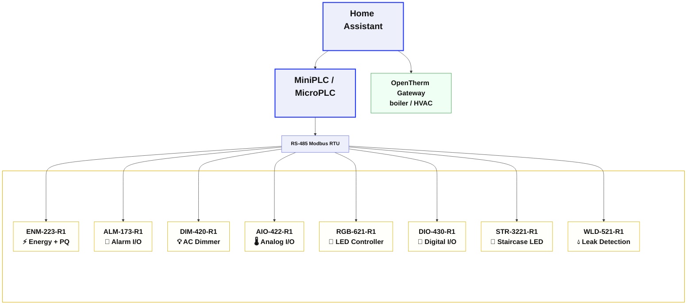

# HOMEMASTER – Modular, Open, Local‑First Automation


HomeMaster combines the reliability and modularity of industrial DIN‑rail automation with the openness of the ESPHome / Home Assistant ecosystem — fully open hardware and firmware, local‑first, no cloud, no vendor lock‑in.

**Website:** [home-master.eu](https://www.home-master.eu/) · **Shop / Products:** [Products](https://www.home-master.eu/products) · **Releases:** [GitHub Releases](https://github.com/isystemsautomation/homemaster-dev/releases)

---

## Why HomeMaster

| Strength | What you get |
|---|---|
| **Fully open** | Hardware under **CERN‑OHL‑W v2**, firmware and ESPHome configs under **MIT**. Schematics, PCB data, and firmware are public — repairable, reproducible, no lock‑in. You can build or modify your own boards. |
| **Native ESPHome API** | Controllers talk to Home Assistant over the native API — **no MQTT broker**, no hand‑mapped Modbus registers, no protocol converters. Devices appear as ready‑to‑use entities, low latency, fully local. |
| **Local‑first / edge‑resilient** | *The controller does the thinking; the server only visualizes.* Critical logic runs on the controller and on each module. Lighting, leak shut‑off, and alarm actions keep working if the network or Home Assistant is down. No cloud; data stays on site (GDPR‑friendly). |
| **Distributed logic** | Each Modbus I/O module runs onboard rules. **RP2350 modules** persist configuration in on‑device flash (**LittleFS**) across reboots and power loss. |
| **Standard RS‑485 Modbus RTU** | A deterministic, robust wired bus. Modules speak standard Modbus RTU and work with **any Modbus master** — HomeMaster controllers, third‑party PLCs, or industrial HMI / SCADA systems. Not locked to HomeMaster. |
| **Driverless USB‑C WebConfig** | Set Modbus address, calibrate, and map inputs/rules from a Chromium browser. No drivers, no install. |
| **EU design, CE marked** | Designed and placed on the market as **CE marked** products. Directives and the signed EU Declaration of Conformity are listed under [Safety & compliance](#safety--compliance). |
| **Developer‑friendly** | ESPHome, Arduino, PlatformIO, MicroPython, ESP‑IDF, Pico SDK / CircuitPython, and UF2 drag‑and‑drop on RP2350 modules. |

---

## Hardware Guide

Industrial‑grade DIN‑rail controllers and I/O modules for smart homes, labs, and professional installations:

- **ESP32 controllers** — [MiniPLC](./MiniPLC/) and [MicroPLC](./MicroPLC/) (ESPHome pre‑installed; Modbus RTU masters on RS‑485)
- **[OpenTherm Gateway](./OpenthermGateway/)** — ESP32 OpenTherm **master** for boiler telemetry and control in Home Assistant (not a Modbus slave)
- **RP2350 Modbus I/O modules** — energy, lighting, analog, alarm, leak detection, and more
- **RS‑485 Modbus RTU** field bus and **USB‑C WebConfig** on every module

### System Architecture



OpenTherm Gateway joins Home Assistant over the native ESPHome API (same as the controllers). Modbus I/O modules sit on the RS‑485 bus behind MiniPLC / MicroPLC.

#### Quick module selector
- 💡 **Lighting** → DIM‑420‑R1, RGB‑621‑R1, STR‑3221‑R1
- ⚡ **Measurement & protection** → ENM‑223‑R1, WLD‑521‑R1
- 🚨 **Monitoring / alarm I/O** → ALM‑173‑R1 *(automation module — not a certified intruder alarm)*
- 🔌 **General I/O** → DIO‑430‑R1, AIO‑422‑R1
- 🔥 **Boiler / HVAC** → [OpenTherm Gateway](./OpenthermGateway/) · [🛒 Product page](https://www.home-master.eu/shop/opentherm-gateway-59)

### Controller Comparison

| Feature / Use Case | 🟢 [**MiniPLC**](./MiniPLC/) <br> [🛒 Product page](https://www.home-master.eu/shop/esp32-miniplc-55) <br> <a href="./MiniPLC/"></a> | 🔵 [**MicroPLC**](./MicroPLC/) <br> [🛒 Product page](https://www.home-master.eu/shop/esp32-microplc-56) <br> <a href="./MicroPLC/"></a> | 🔥 [**OpenTherm Gateway**](./OpenthermGateway/) <br> [🛒 Product page](https://www.home-master.eu/shop/opentherm-gateway-59) <br> <a href="./OpenthermGateway/"></a> |
|--------------------|---|---|---|
| **Role** | Flagship ESP32 Modbus master + rich onboard I/O | Compact ESP32 Modbus master — entry into the system | ESP32 OpenTherm **master** (not a Modbus slave) |
| **Onboard I/O** | 6× relays, 4× DI, 4× AI 0–10 V (16‑bit), 1× AO, 2× RTD, 2× 1‑Wire, OLED, RTC | 1× relay, 1× DI, 1‑Wire, RTC | OpenTherm interface, 1× relay, 1‑Wire |
| **Connectivity** | Ethernet, USB‑C, Wi‑Fi, BLE + Improv | USB‑C, Wi‑Fi, BLE + Improv | USB‑C, Wi‑Fi, BLE + Improv |
| **Storage** | microSD card slot | Internal flash | Internal flash |
| **Ideal for** | Full homes, labs, HVAC/solar, standalone offline control | Room‑level control, compact cabinets, modular expansion | Boiler telemetry & weather‑compensated heating in HA |
| **Power** | AC/DC wide range or 24 VDC | 24 VDC only | AC/DC wide range or 24 VDC |
| **Firmware** | ESPHome pre‑installed; runs standalone & offline | ESPHome pre‑installed | ESPHome pre‑installed |

> **OpenTherm relay note:** the gateway relay must not be wired across a different mains phase or isolated mains source than the device L/N supply (PCB insulation is Basic). See the [OpenTherm Gateway README](./OpenthermGateway/).

### Module Overview

| Image | Module | Inputs | Outputs | Key Features | Best For | 🛒 Product page |
|---|---|---|---|---|---|---|
| <a href="./ENM-223-R1/"></a> | [**ENM‑223‑R1**](./ENM-223-R1/) | 3‑phase V + CTs | 2 relays | ATM90E32 metrology + PQ events (sag, phase‑loss, overcurrent, reverse‑phase); local alarm engine / load‑shed relays; **5 kV RMS** digital isolation | Solar, grid, protect‑and‑measure | [Product page](https://www.home-master.eu/shop/enm-223-r1-energy-metering-737) |
| <a href="./ALM-173-R1/"></a> | [**ALM‑173‑R1**](./ALM-173-R1/) | 17 DI | 3 relays | AUX loop power for detectors + local alarm logic. **Automation / monitoring module — not a certified or insurance‑grade intruder alarm.** | Contact / detector monitoring | [Product page](https://www.home-master.eu/shop/alm-173-r1-alarm-systems-733) |
| <a href="./DIM-420-R1/"></a> | [**DIM‑420‑R1**](./DIM-420-R1/) | 4 DI | 2× phase‑cut AC | Leading / trailing edge dimming + local switch mapping that works offline | AC lighting | [Product page](https://www.home-master.eu/shop/dim-420-r1-ac-dimmer-module-736) |
| <a href="./AIO-422-R1/"></a> | [**AIO‑422‑R1**](./AIO-422-R1/) | 4× AI 0–10 V + 2× RTD | 2× AO 0–10 V | HVAC / process‑grade analog + PT100/PT1000 in one module | HVAC, process sensors | [Product page](https://www.home-master.eu/shop/aio-422-r1-analog-io-rtd-735) |
| <a href="./DIO-430-R1/"></a> | [**DIO‑430‑R1**](./DIO-430-R1/) | 4 DI | 3 relays | Physical override buttons + local DI→relay mapping without a server | General control | [Product page](https://www.home-master.eu/shop/dio-430-r1-relay-module-58) |
| <a href="./RGB-621-R1/"></a> | [**RGB‑621‑R1**](./RGB-621-R1/) | 2 DI | 5 PWM + 1 relay | RGB + tunable white (CCT); **12‑bit + gamma‑corrected smooth dimming** | Color / white LED strips | [Product page](https://www.home-master.eu/shop/rgb-621-r1-rgbcct-module-57) |
| <a href="./STR-3221-R1/"></a> | [**STR‑3221‑R1**](./STR-3221-R1/) | 1 DI + 2 presence | 32 LED channels | Motion‑triggered staircase / architectural animations | Stair & path lighting | [Product page](https://www.home-master.eu/shop/str-3221-r1-stair-leds-module-66) |
| <a href="./WLD-521-R1/"></a> | [**WLD‑521‑R1**](./WLD-521-R1/) | 5 DI + temp | 2 relays | Multi‑zone leak detection, local auto valve shut‑off, pulse water metering | Leak safety & metering | [Product page](https://www.home-master.eu/shop/wld-521-r1-water-meter-leak-1035) |

#### Module highlights
- **ENM‑223‑R1** — measures *and* protects: 3‑phase ATM90E32 metrology with power‑quality event detection and a local relay alarm engine for load‑shedding, not metering alone.
- **AIO‑422‑R1** — 4× 0–10 V in, 2× 0–10 V out, and 2× RTD (PT100/PT1000) in a single DIN module.
- **ALM‑173‑R1** — dense DI count with AUX detector power and onboard logic for automation monitoring (not a certified alarm panel).
- **DIM‑420‑R1** — two‑channel phase‑cut AC dimmer with offline local switch mapping.
- **DIO‑430‑R1** — relays, inputs, front override buttons, and DI→relay rules that survive loss of the server.
- **RGB‑621‑R1** — RGB+CCT on five PWM channels with 12‑bit gamma‑corrected dimming, plus a strip power relay.
- **STR‑3221‑R1** — 32‑channel staircase LED controller with presence inputs and motion‑triggered sequences.
- **WLD‑521‑R1** — five leak zones, temperature, local valve shut‑off, and pulse water metering on one module.

### Recommended setups
- 🏠 **Starter (lighting + I/O)** — MicroPLC + DIO‑430‑R1 + RGB‑621‑R1  
  _Wall switches, RGB strip control, local DI→relay mapping_
- ⚡ **Energy monitoring** — MicroPLC + ENM‑223‑R1  
  _Grid / solar / 3‑phase loads with local PQ alarms_
- 🧪 **Lab / HVAC** — MiniPLC + AIO‑422‑R1 + DIO‑430‑R1  
  _Analog, RTD, and discrete I/O with standalone controller logic_
- 💧 **Leak safety** — MicroPLC + WLD‑521‑R1 + ALM‑173‑R1  
  _Leak sensors, auto‑valve, contact monitoring_
- 🌈 **Advanced lighting** — MiniPLC + RGB‑621‑R1 + DIM‑420‑R1 + STR‑3221‑R1  
  _RGB/CCT, phase‑cut AC, staircase animations_
- 🔥 **Boiler control** — OpenTherm Gateway (+ MiniPLC/MicroPLC for the rest of the plant)  
  _Full OpenTherm telemetry in Home Assistant_

---

## Quick Start

### 5‑minute setup
1. **Power the controller** — ESPHome is pre‑installed on MiniPLC, MicroPLC, and OpenTherm Gateway.  
2. **Join Wi‑Fi with Improv** — BLE or Serial via [improv-wifi.com](https://improv-wifi.com).  
3. **Wire RS‑485** (controllers + I/O modules) — A/B differential pair; **120 Ω termination** at both bus ends.  
4. **Configure each module** — USB‑C → WebConfig: Modbus address, calibration, mapping, rules.  
5. **Open Home Assistant** — add the ESPHome device; I/O modules appear as entities through the controller packages.

OpenTherm Gateway skips step 3–4 for Modbus: wire OT+/OT− to the boiler and commission it like any ESPHome device.

---

## Configuration

### Compatibility
| Component | Home Assistant | ESPHome | Standalone / offline logic |
|---|---|---|---|
| **Modbus I/O modules** | ✅ via controller packages | ✅ native packages | ✅ onboard rules + LittleFS |
| **MiniPLC** | ✅ full | ✅ pre‑installed | ✅ full |
| **MicroPLC** | ✅ full | ✅ pre‑installed | ✅ basic onboard I/O |
| **OpenTherm Gateway** | ✅ full | ✅ pre‑installed | ✅ relay + 1‑Wire without boiler link |

### Controller setup
1. Power on  
2. Connect via **improv-wifi.com** (BLE or USB)  
3. Enter Wi‑Fi credentials  
4. Device appears in **ESPHome Dashboard** and **Home Assistant**

### Module configuration (WebConfig)
Each Modbus module includes **USB WebConfig** — no drivers:
- Set **Modbus address** and **baud rate**
- Configure **relay behavior** and **input mappings**
- Perform **calibration** and **live diagnostics**
- Adjust **alarm thresholds** and **LED modes**

> WebConfig works in Chrome / Edge / other Chromium browsers — plug in **USB‑C** and click **Connect**. Settings on RP2350 modules persist in **LittleFS**.

### Networking
- **RS‑485 Modbus:** `19200 8N1` (default), **120 Ω termination** required — deterministic wired field bus  
- **Wi‑Fi:** controllers and OpenTherm Gateway; **Improv** onboarding  
- **Ethernet:** MiniPLC (optional LAN8720)  
- **USB‑C:** configuration and programming  

---

## Advanced

### Firmware development
All HomeMaster controllers and modules support firmware customization via **USB‑C**.

- **ESPHome YAML** (pre-installed on controllers and OpenTherm Gateway)
- **Arduino IDE** (ESP32 and RP2040/RP2350)
- **PlatformIO** (cross-platform)
- **MicroPython** (via Thonny)
- **ESP-IDF** (ESP32-based controllers)
- **Pico SDK / CircuitPython** (RP2350-based modules)

### USB‑C developer flashing
Controllers and modules support flashing and auto-reset via **USB‑C**, without pressing BOOT or RESET.

- **ESP32** (MiniPLC, MicroPLC, OpenTherm Gateway): Arduino IDE, PlatformIO, ESP-IDF, or ESPHome Dashboard.
- **RP2350 modules**: drag‑and‑drop **UF2** and the RP2040/RP2350 toolchain (Pico SDK, CircuitPython).

> All devices ship with pre-installed firmware. Controllers and the OpenTherm Gateway are ESPHome-ready. Modules are functional out of the box and configurable via WebConfig. Flashing is only required to replace the default firmware.

### Build environment (reproducible)

RP2350 module firmware (**v0.2.0** sketches) is built with the **arduino-pico** core (Earle Philhower). Each sketch folder includes a `sketch.yaml` manifest; GitHub Actions compiles all seven modules and publishes `.uf2` artifacts.

#### Core & board

| Item | Value |
|---|---|
| Core | **arduino-pico** — platform id `rp2040:rp2040` |
| Board Manager URL | `https://github.com/earlephilhower/arduino-pico/releases/download/global/package_rp2040_index.json` |
| Board | **Generic RP2350** (`generic_rp2350`) |
| Base FQBN | `rp2040:rp2040:generic_rp2350:flash=2097152_1048576` |

**Install core (arduino-cli):**

```bash
arduino-cli config add board_manager.additional_urls \
  https://github.com/earlephilhower/arduino-pico/releases/download/global/package_rp2040_index.json
arduino-cli core update-index
arduino-cli core install rp2040:rp2040@5.6.0
```

**Arduino IDE:** Boards Manager → search **RP2040/RP2350 by Earle F. Philhower** → install **5.6.0** → select board **Generic RP2350**.

> **Flash Size / LittleFS (required for RP2350 module sketches):** In Arduino IDE → **Tools → Flash Size**, choose **2MB (Sketch: 1MB, FS: 1MB)** — the sketches persist config in LittleFS. FQBN suffix: `:flash=2097152_1048576` (already set in each `sketch.yaml` and CI).

Provided by the core (do **not** list in `sketch.yaml`): `LittleFS`, `Wire`, `OneWire` (WLD), `pico/time.h`, `hardware/watchdog.h`. Local sketch headers: `hm_common.h` (all modules), `atm90e32.h` (ENM only).

#### Libraries by module (Library Manager)

| Module | Additional libraries | Common (all modules) |
|---|---|---|
| AIO-422-R1 | ADS1X15, Adafruit MAX31865 library, Adafruit MCP4725, Adafruit BusIO | Arduino_JSON, Modbus-Arduino, Modbus-Serial, Simple Web Serial |
| ALM-173-R1 | PCF8574 | Arduino_JSON, Modbus-Arduino, Modbus-Serial, Simple Web Serial |
| DIM-420-R1 | — | Arduino_JSON, Modbus-Arduino, Modbus-Serial, Simple Web Serial |
| DIO-430-R1 | — | Arduino_JSON, Modbus-Arduino, Modbus-Serial, Simple Web Serial |
| ENM-223-R1 | — *(atm90e32.h local)* | Arduino_JSON, Modbus-Arduino, Modbus-Serial, Simple Web Serial |
| RGB-621-R1 | — | Arduino_JSON, Modbus-Arduino, Modbus-Serial, Simple Web Serial |
| WLD-521-R1 | — | Arduino_JSON, Modbus-Arduino, Modbus-Serial, Simple Web Serial |

Pinned versions are listed in each sketch’s **`sketch.yaml`** (aligned with CI).

#### Two ways to build

1. **Arduino IDE** — install core and libraries at the versions listed in the module’s `sketch.yaml`, open the `.ino` sketch, set board/FQBN and **Flash Size** as above, then **Sketch → Export Compiled Binary** (UF2 appears under `build/<fqbn>/`).

2. **arduino-cli / CI (recommended)** — reproducible, isolated build from the manifest:

```bash
cd DIO-430-R1/Firmware/v0.2.0/default_DIO_430_R1   # example
arduino-cli compile --profile default .
# or, before versions are pinned in sketch.yaml:
arduino-cli compile --fqbn rp2040:rp2040:generic_rp2350 --export-binaries .
```

CI workflow: [`.github/workflows/build-firmware.yml`](.github/workflows/build-firmware.yml) — runs on changes under `*/Firmware/v0.2.0/**`, uploads artifact `firmware-<sketch>` containing `*.ino.uf2` per module.

> **Note:** Arduino IDE 2.x does **not** compile from `sketch.yaml` today; the manifest is for **arduino-cli** and CI, and as the version reference for IDE users (install matching library/core versions manually).

### Home Assistant Example (ESPHome)
```yaml
# Example ESPHome configuration for Alarm Module
uart:
  id: uart_modbus
  tx_pin: 17
  rx_pin: 16
  baud_rate: 19200
  parity: NONE
  stop_bits: 1

modbus:
  id: modbus_bus
  uart_id: uart_modbus
  turnaround_time: 100ms
  send_wait_time: 250ms

# ---------- Pull ALM Modbus entities from GitHub ----------
packages:

  alm1:
    url: https://github.com/isystemsautomation/homemaster-dev
    ref: main
    files:
      - path: ALM-173-R1/Firmware/v0.2.0/default_alm_173_r1_plc/default_alm_173_r1_plc.yaml
```

> **ESPHome 2026.7.0 raised the Modbus client defaults** — `turnaround_time` from
> 100 ms to 600 ms and `send_wait_time` from 250 ms to 2000 ms (PR #11969).
>
> At the 600 ms default the bus carries only about 1.5 Modbus transactions per
> second, whatever the UART speed, because the controller stays silent for 600 ms
> after every response. Two modules on one RS-485 bus become slow to respond.
> With three or more, one module can stop being polled altogether — with no
> timeout and no CRC error in the log.
>
> On ESPHome 2026.7.0 and newer, set both values explicitly as shown above.
> On earlier releases these were the defaults and the two lines are not required.

---

## Resources

- 🌐 **Support:** https://www.home-master.eu/support  
- 🛒 **Shop / Products:** https://www.home-master.eu/products  
- 🧠 **Hackster.io:** [Projects & tutorials](https://www.hackster.io/homemaster)  
- 🎥 **YouTube:** [Video guides](https://www.youtube.com/@HomeMasterAutomation)  
- 💬 **Reddit:** [r/HomeMaster](https://www.reddit.com/r/HomeMaster)  
- 📷 **Instagram:** [@home_master.eu](https://www.instagram.com/home_master.eu)

---

## Safety & compliance

### Electrical safety
- Only trained personnel should install or service modules
- Disconnect all power before wiring
- Follow local electrical codes and standards

### Installation
- Mount on 35 mm DIN rails in protective enclosures
- Separate low‑voltage and high‑voltage wiring
- Avoid moisture, chemicals, and extreme temperatures

### Device‑specific warnings
- Connect PE/N properly for metering modules
- Use correct CTs (1 V or 333 mV) — never connect 5 A CTs directly
- Avoid reverse polarity on RS‑485 lines
- OpenTherm Gateway: observe the relay cross‑mains restriction in the device README

### CE marking
HomeMaster modules and controllers are **CE marked**. Relevant frameworks include:

- **EMC** — Directive 2014/30/EU  
- **LVD** — Directive 2014/35/EU, EN 62368‑1  
- **RoHS** — applicable substance restrictions  

A signed **EU Declaration of Conformity (DoC)** is available for each device (see the device folder / Manuals, and the shop product page). CE here is a compliance fact, not a performance claim.

---

## License

This project uses a hybrid licensing model.

**Hardware** (schematics, PCB layouts, BOMs): **CERN‑OHL‑W v2**

**Firmware & ESPHome integration:** **MIT License**

This keeps full compatibility with ESPHome and Home Assistant while protecting the open hardware designs under CERN‑OHL‑W v2.

See `LICENSE` files in each directory for full terms.

---

## Versioning & updates

Firmware packages, binaries, and release notes are published on the repository **[Releases](https://github.com/isystemsautomation/homemaster-dev/releases)** page. Do not rely on a hardcoded series string in this README — always use the latest release notes for the module you are installing.

**Documentation last updated:** 2026-07-26
