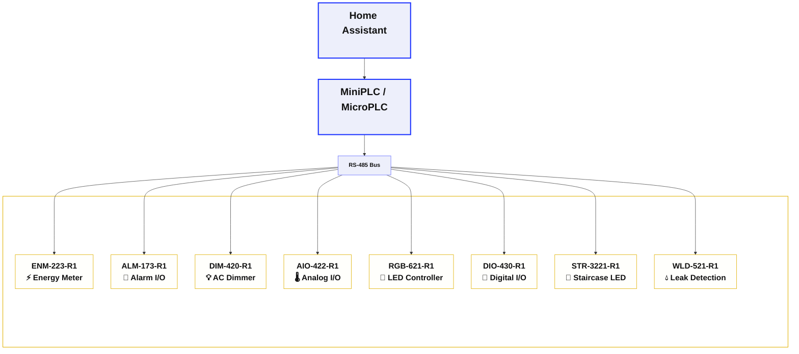

# HOMEMASTER – Modular, Resilient Smart Automation System


> **Releases:** see the latest tagged build on GitHub Releases. Versioning uses **YYYY‑MM**.  
> Fully open‑source hardware, firmware, and configuration tools. **CE marked.**

**Website:** [home-master.eu](https://www.home-master.eu/) · **Shop / Products:** [Products](https://www.home-master.eu/products)

---


## 🛠️ Hardware Guide
HomeMaster is an **industrial‑grade, modular automation system** for smart homes, labs, and professional installations. It features:

- ESP32‑based PLC controllers (**MiniPLC & MicroPLC**) — same platform & memory class
- **OpenTherm Gateway** for boiler / HVAC control
- A family of smart I/O modules (energy monitoring, lighting, alarms, analog I/O, etc.)
- **RS‑485 Modbus RTU** communication
- **ESPHome** compatibility for **Home Assistant**
- **USB‑C** & **WebConfig** UI for driverless configuration

> **Local resilience:** Modules include onboard logic and continue functioning even if the controller or network is offline.

### System Architecture



#### 🎯 Quick Module Selector
- 💡 **Lighting Control** → DIM‑420‑R1, RGB‑621‑R1, STR‑3221‑R1  
- ⚡ **Measurement & Protection** → ENM‑223‑R1, WLD‑521‑R1  
- 🚨 **Security/Alarms** → ALM‑173‑R1
- 🔌 **General I/O** → DIO‑430‑R1, AIO‑422‑R1   
- 🔥 **Boiler / HVAC** → [OpenTherm Gateway](./OpenthermGateway/) · [🛒 Product page](https://www.home-master.eu/shop/opentherm-gateway-59)

### Controller Comparison

| Feature / Use Case | 🟢 [**MiniPLC**](./MiniPLC/) <br> [🛒 Product page](https://www.home-master.eu/shop/esp32-miniplc-55) <br> <a href="./MiniPLC/"></a> | 🔵 [**MicroPLC**](./MicroPLC/) <br> [🛒 Product page](https://www.home-master.eu/shop/esp32-microplc-56) <br> <a href="./MicroPLC/"></a> | 🔥 [**OpenTherm Gateway**](./OpenthermGateway/) <br> [🛒 Product page](https://www.home-master.eu/shop/opentherm-gateway-59) <br> <a href="./OpenthermGateway/"></a> |
|--------------------|----------------------------------------------------------------------------------------------------------------------------------|--------------------------------------------------------------------------------------------------------------------------------------------|----------------------------------------------------------------------------------------------------------------------------------|
| **Size**           | Full‑width DIN enclosure                                                                                                         | Compact DIN enclosure                                                                                 | Compact DIN enclosure |
| **Onboard I/O**    | 6× Relays, 4× DI, 2× RTD, 2× AI/O, Display, RTC                                                                                   | 1× Relay, 1× DI, 1‑Wire, RTC                                                                          | OpenTherm master, 1× Relay, 1‑Wire |
| **Connectivity**   | Ethernet, USB‑C, Wi‑Fi, BLE + Improv                                                                                             | USB‑C, Wi‑Fi, BLE + Improv                                                                           | USB‑C, Wi‑Fi, BLE + Improv |
| **Storage**        | microSD card slot                                                                                                                | Internal flash only                                                                                  | Internal flash only |
| **Ideal For**      | Full homes, labs, HVAC/solar, automation pros                                                                                    | Makers, room‑level, modular expansion setups                                                         | Boiler control, weather compensation |
| **Power Input**    | AC/DC wide range or 24 VDC                                                                                                       | 24 VDC only                                                                                           | AC/DC wide range or 24 VDC |


### Module Overview

| Image | Module | Inputs | Outputs | Key Features | Best For | 🛒 Product page |
|---|---|---|---|---|---|---|
| <a href="./ENM-223-R1/"></a> | [**ENM‑223‑R1**](./ENM-223-R1/) | 3‑Phase CTs | 2 Relays | Per‑phase power metrics | Solar, grid monitoring | [Product page](https://www.home-master.eu/shop/enm-223-r1-energy-metering-737) |
| <a href="./ALM-173-R1/"></a> | [**ALM‑173‑R1**](./ALM-173-R1/) | 17 DI | 3 Relays | AUX power, alarm logic | Security systems | [Product page](https://www.home-master.eu/shop/alm-173-r1-alarm-systems-733) |
| <a href="./DIM-420-R1/"></a> | [**DIM‑420‑R1**](./DIM-420-R1/) | 4 DI | 2 Dimming | Phase‑cut dimming | Lighting control | [Product page](https://www.home-master.eu/shop/dim-420-r1-ac-dimmer-module-736) |
| <a href="./AIO-422-R1/"></a> | [**AIO‑422‑R1**](./AIO-422-R1/) | 4 AI + 2 RTD | 2 AO | 0‑10V I/O, PT100/1000 | HVAC, sensors | [Product page](https://www.home-master.eu/shop/aio-422-r1-analog-io-rtd-735) |
| <a href="./DIO-430-R1/"></a> | [**DIO‑430‑R1**](./DIO-430-R1/) | 4 DI | 3 Relays | Override buttons, logic mapping | General control | [Product page](https://www.home-master.eu/shop/dio-430-r1-relay-module-58) |
| <a href="./RGB-621-R1/"></a> | [**RGB‑621‑R1**](./RGB-621-R1/) | 2 DI | 5 PWM + 1 Relay | RGB+CCT, 12-bit + gamma-corrected smooth dimming | Color lighting | [Product page](https://www.home-master.eu/shop/rgb-621-r1-rgbcct-module-57) |
| <a href="./STR-3221-R1/"></a> | [**STR‑3221‑R1**](./STR-3221-R1/) | 1 DI + 2 presence | 32 LED Channels | Animated sequences | Architectural lighting | [Product page](https://www.home-master.eu/shop/str-3221-r1-stair-leds-module-66) |
| <a href="./WLD-521-R1/"></a> | [**WLD‑521‑R1**](./WLD-521-R1/) | 5 DI + Temp | 2 Relays | Leak detection, pulse metering | Safety systems | [Product page](https://www.home-master.eu/shop/wld-521-r1-water-meter-leak-1035) |


### Recommended Setups
- 🏠 **Starter (Lighting + I/O)** — MicroPLC + DIO‑430‑R1 + RGB‑621‑R1  
  _Basic lighting control, wall switch input, RGB strip control_
- ⚡ **Energy Monitoring** — MicroPLC + ENM‑223‑R1  
  _Track grid power, solar production, or 3‑phase loads_
- 🧪 **Professional Lab** — MiniPLC + AIO‑422‑R1 + DIO‑430‑R1  
  _Complex automation with analog, temperature, safety logic_
- 💧 **Safety & Leak Detection** — MicroPLC + WLD‑521‑R1 + ALM‑173‑R1  
  _Leak sensors, alarm inputs, auto‑valve control_
- 🌈 **Advanced Lighting** — MiniPLC + RGB‑621‑R1 + DIM‑420‑R1 + STR‑3221‑R1  
  _Complete lighting control with scenes and animations_

---

## 🚀 Quick Start
### 5‑Minute Setup
1. **Power the controller** — **ESPHome is pre‑installed** on MiniPLC and MicroPLC.  
2. **Join Wi‑Fi with Improv** — Use **Improv** (BLE **or** Serial) to set Wi‑Fi and adopt the device.  
3. **Wire RS‑485** — A/B differential pair; **120 Ω termination** at both bus ends.  
4. **Configure each module** — Connect via **USB‑C** and use **WebConfig** to set **Modbus address and module settings** (calibration, mapping, rules).  
5. **Open Home Assistant** — Add the ESPHome controller; modules appear as entities via the controller config.

## ⚙️ Configuration

### Compatibility
| Component | Home Assistant | ESPHome | Standalone |
|---|---|---|---|
| **All Modules** | ✅ Full | ✅ Native | ✅ Basic |
| **MiniPLC** | ✅ Full | ✅ Pre‑installed | ✅ Full |
| **MicroPLC** | ✅ Full | ✅ Pre‑installed | ✅ Basic |

### Controller Setup
All HomeMaster controllers come with ESPHome pre‑installed and support Improv onboarding:
1. Power on the controller  
2. Connect via **improv-wifi.com** (BLE or USB)  
3. Enter Wi‑Fi credentials  
4. Appears in **ESPHome Dashboard** & **Home Assistant**

### Module Configuration (WebConfig)
Each module includes **USB WebConfig** — no drivers needed:
- Set **Modbus address** and **baud rate**
- Configure **relay behavior** and **input mappings**
- Perform **calibration** and **live diagnostics**
- Adjust **alarm thresholds** and **LED modes**

> 💡 WebConfig works in Chrome/Edge — just plug in **USB‑C** and click **Connect**

### Networking
- **RS‑485 Modbus:** `19200 8N1` (default), **120 Ω termination** required  
- **Wi‑Fi:** Both controllers; **Improv** onboarding  
- **Ethernet:** MiniPLC only for stable connections  
- **USB‑C:** Configuration and programming

---

## 🔧 Advanced

### Firmware Development
All HomeMaster controllers and modules support firmware customization via **USB‑C**.

- **ESPHome YAML** (pre-installed on controllers)
- **Arduino IDE** (both ESP32 and RP2040/RP2350)
- **PlatformIO** (cross-platform)
- **MicroPython** (via Thonny)
- **ESP-IDF** (for ESP32-based controllers)
- **Pico SDK / CircuitPython** (for RP2350-based modules)

### USB‑C Developer Flashing
Both controllers and modules support easy flashing and auto-reset via **USB‑C**, with no need to press BOOT or RESET buttons.

- **ESP32-based controllers** (MiniPLC, MicroPLC): programmable using Arduino IDE, PlatformIO, ESP-IDF, or ESPHome Dashboard.
- **RP2350-based modules**: support drag‑and‑drop **UF2 flashing** and tools from the RP2040 ecosystem (e.g., Pico SDK, CircuitPython).

> ⚠️ Note: All controllers and modules ship with pre-installed firmware.  
> - **Controllers** are ESPHome-ready and appear in Home Assistant.
> - **Modules** are fully functional out-of-the-box and configurable via the **WebConfig Tool**.

Flashing is only required for advanced users who want to replace default firmware.

### Build environment (reproducible)

RP2350 module firmware (**v0.2.0** sketches) is built with the **arduino-pico** core (Earle Philhower). Each sketch folder includes a `sketch.yaml` manifest; GitHub Actions compiles all seven modules and publishes `.uf2` artifacts.

#### Core & board

| Item | Value |
|---|---|
| Core | **arduino-pico** — platform id `rp2040:rp2040` |
| Board Manager URL | `https://github.com/earlephilhower/arduino-pico/releases/download/global/package_rp2040_index.json` |
| Board | **Generic RP2350** (`generic_rp2350`) |
| Base FQBN | `rp2040:rp2040:generic_rp2350:flash=2097152_1048576` |

**Install core (arduino-cli):**

```bash
arduino-cli config add board_manager.additional_urls \
  https://github.com/earlephilhower/arduino-pico/releases/download/global/package_rp2040_index.json
arduino-cli core update-index
arduino-cli core install rp2040:rp2040@5.6.0
```

**Arduino IDE:** Boards Manager → search **RP2040/RP2350 by Earle F. Philhower** → install **5.6.0** → select board **Generic RP2350**.

> **Flash Size / LittleFS (required):** In Arduino IDE → **Tools → Flash Size**, choose **2MB (Sketch: 1MB, FS: 1MB)** — the sketches persist config in LittleFS. FQBN suffix: `:flash=2097152_1048576` (already set in each `sketch.yaml` and CI).

Provided by the core (do **not** list in `sketch.yaml`): `LittleFS`, `Wire`, `OneWire` (WLD), `pico/time.h`, `hardware/watchdog.h`. Local sketch headers: `hm_common.h` (all modules), `atm90e32.h` (ENM only).

#### Libraries by module (Library Manager)

| Module | Additional libraries | Common (all modules) |
|---|---|---|
| AIO-422-R1 | ADS1X15, Adafruit MAX31865 library, Adafruit MCP4725, Adafruit BusIO | Arduino_JSON, Modbus-Arduino, Modbus-Serial, Simple Web Serial |
| ALM-173-R1 | PCF8574 | Arduino_JSON, Modbus-Arduino, Modbus-Serial, Simple Web Serial |
| DIM-420-R1 | — | Arduino_JSON, Modbus-Arduino, Modbus-Serial, Simple Web Serial |
| DIO-430-R1 | — | Arduino_JSON, Modbus-Arduino, Modbus-Serial, Simple Web Serial |
| ENM-223-R1 | — *(atm90e32.h local)* | Arduino_JSON, Modbus-Arduino, Modbus-Serial, Simple Web Serial |
| RGB-621-R1 | — | Arduino_JSON, Modbus-Arduino, Modbus-Serial, Simple Web Serial |
| WLD-521-R1 | — | Arduino_JSON, Modbus-Arduino, Modbus-Serial, Simple Web Serial |

Pinned versions are listed in each sketch’s **`sketch.yaml`** (aligned with CI).

#### Two ways to build

1. **Arduino IDE** — install core and libraries at the versions listed in the module’s `sketch.yaml`, open the `.ino` sketch, set board/FQBN and **Flash Size** as above, then **Sketch → Export Compiled Binary** (UF2 appears under `build/<fqbn>/`).

2. **arduino-cli / CI (recommended)** — reproducible, isolated build from the manifest:

```bash
cd DIO-430-R1/Firmware/v0.2.0/default_DIO_430_R1   # example
arduino-cli compile --profile default .
# or, before versions are pinned in sketch.yaml:
arduino-cli compile --fqbn rp2040:rp2040:generic_rp2350 --export-binaries .
```

CI workflow: [`.github/workflows/build-firmware.yml`](.github/workflows/build-firmware.yml) — runs on changes under `*/Firmware/v0.2.0/**`, uploads artifact `firmware-<sketch>` containing `*.ino.uf2` per module.

> **Note:** Arduino IDE 2.x does **not** compile from `sketch.yaml` today; the manifest is for **arduino-cli** and CI, and as the version reference for IDE users (install matching library/core versions manually).

### Home Assistant Example (ESPHome)
```yaml
# Example ESPHome configuration for Alarm Module
uart:
  id: uart_modbus
  tx_pin: 17
  rx_pin: 16
  baud_rate: 19200
  parity: NONE
  stop_bits: 1

modbus:
  id: modbus_bus
  uart_id: uart_modbus
  turnaround_time: 100ms
  send_wait_time: 250ms

# ---------- Pull ALM Modbus entities from GitHub ----------
packages:

  alm1:
    url: https://github.com/isystemsautomation/homemaster-dev
    ref: main
    files:
      - path: ALM-173-R1/Firmware/v0.2.0/default_alm_173_r1_plc/default_alm_173_r1_plc.yaml
```

> **ESPHome 2026.7.0 raised the Modbus client defaults** — `turnaround_time` from
> 100 ms to 600 ms and `send_wait_time` from 250 ms to 2000 ms (PR #11969).
>
> At the 600 ms default the bus carries only about 1.5 Modbus transactions per
> second, whatever the UART speed, because the controller stays silent for 600 ms
> after every response. Two modules on one RS-485 bus become slow to respond.
> With three or more, one module can stop being polled altogether — with no
> timeout and no CRC error in the log.
>
> On ESPHome 2026.7.0 and newer, set both values explicitly as shown above.
> On earlier releases these were the defaults and the two lines are not required.


---

## 📚 Resources

### 🎓 Learning & Community
- 🌐 **Official Support:** https://home-master.eu/support  
- 🧠 **Hackster.io:** [Projects & tutorials](https://www.hackster.io/homemaster)  
- 🎥 **YouTube:** [Video guides](https://www.youtube.com/@HomeMasterAutomation)  
- 💬 **Reddit:** [r/HomeMaster ](https://www.reddit.com/r/HomeMaster) 
- 📷 **Instagram:** [@home_master.eu](https://www.instagram.com/home_master.eu)


---

## ⚠️ Safety Information

### Electrical Safety
- Only trained personnel should install or service modules
- Disconnect all power before wiring
- Follow local electrical codes and standards

### Installation
- Mount on 35 mm DIN rails in protective enclosures
- Separate low‑voltage and high‑voltage wiring
- Avoid moisture, chemicals, and extreme temperatures

### Device‑specific Warnings
- Connect PE/N properly for metering modules
- Use correct CTs (1 V or 333 mV) — never connect 5 A CTs directly
- Avoid reverse polarity on RS‑485 lines

---

## License

Licensing

This project uses a hybrid licensing model.

Hardware

Hardware designs (schematics, PCB layouts, BOMs) are licensed under:
CERN-OHL-W v2

Firmware & ESPHome Integration

All firmware, ESPHome configurations, and software components are licensed under:
MIT License

This ensures full compatibility with ESPHome and Home Assistant while protecting hardware designs.

See LICENSE files in each directory for full terms.

---

## 🔄 Version Info
**Current:** HomeMaster 2024.12+ series  
**Check:** Releases page for version‑specific notes
