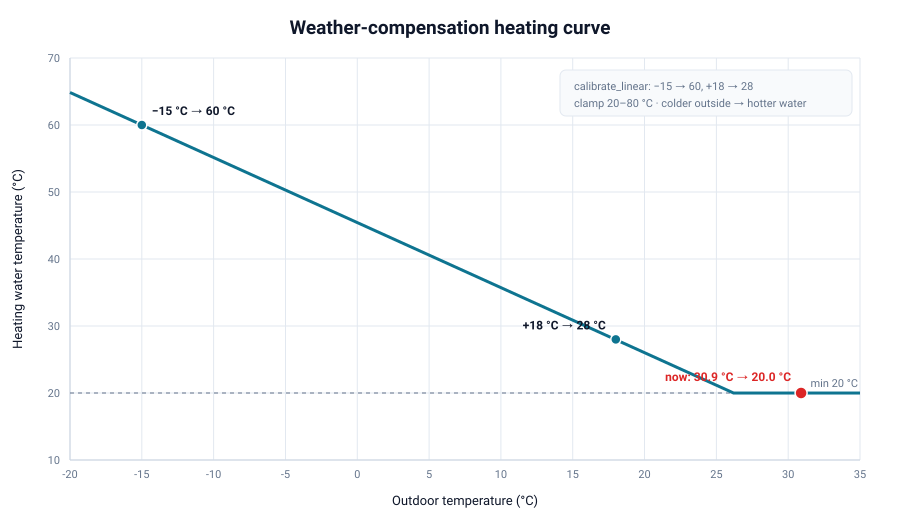
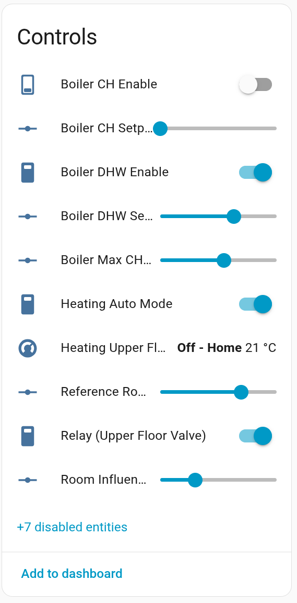
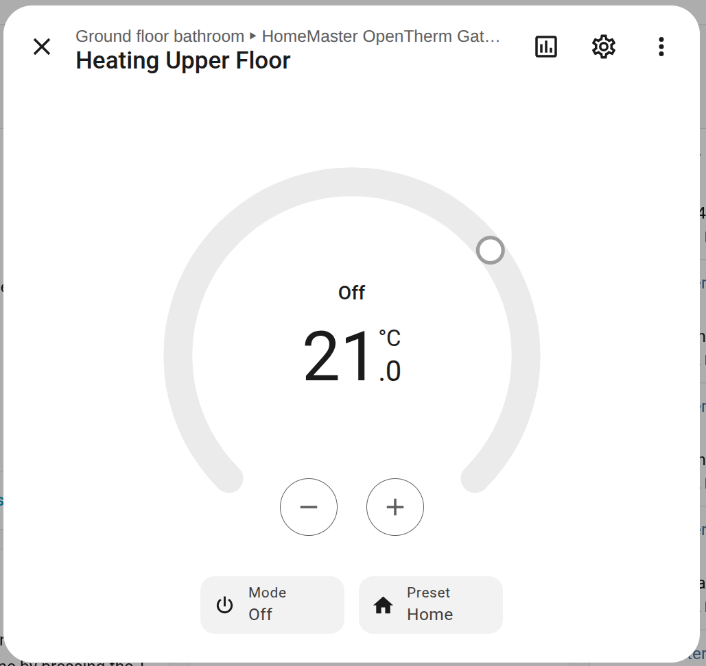
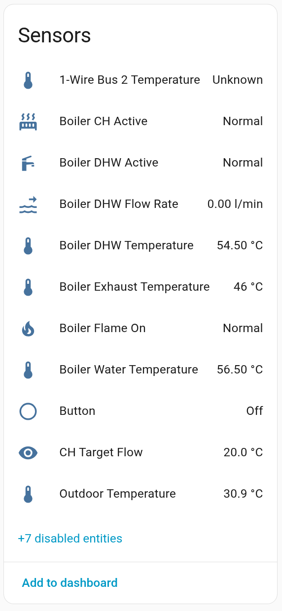

# Weather-Compensated Heating with the HomeMaster OpenTherm Gateway

*By Dmitry Drezyulya · Updated June 11, 2026 · ~10 min read*

The HomeMaster OpenTherm Gateway ships with a working ESPHome configuration that exposes every OpenTherm value your boiler reports and lets you set the central-heating water temperature by hand. That's a solid starting point — but the real win is letting the gateway set that water temperature *for you*, based on how cold it is outside.

In this guide we take the **factory config** and turn it into a proper **weather-compensated controller**: the boiler's flow temperature follows an outdoor-reset curve, gets corrected by an external room thermostat, and a relay opens the upper-floor heating zone while the lower floor stays permanently open. Everything runs locally in Home Assistant — no cloud, no PID tuning marathon, mostly native ESPHome components.

By the end you'll have a config you can flash over WiFi and four new things to look at in Home Assistant.

## What the gateway gives you out of the box

Flash nothing, change nothing, and the gateway already does a lot. The stock ESPHome firmware exposes the boiler over OpenTherm: flow and return temperatures, modulation level, flame and fault flags, CH/DHW enable switches, and — the one we care about most — a **Boiler CH Setpoint** number you can drag to request a flow temperature. It also gives you the onboard relay and two 1-Wire temperature inputs.

> 📷 **SCREENSHOT —** the gateway's device page in Home Assistant on the stock firmware (Controls list: Boiler CH Enable, Boiler CH Setpoint, Relay, sensors). This is our blank canvas.

The limitation: that setpoint is static. You set 60 °C, it stays 60 °C whether it's −15 °C or +12 °C outside. Weather compensation fixes exactly that.

## The plan

We keep the entire factory config and **add** four things:

1. **Outdoor-reset curve** — turn the outdoor temperature into a target flow temperature and write it to the boiler.
2. **External-thermostat correction** — nudge that target up or down based on a real room temperature from Home Assistant.
3. **Upper-floor zone valve** — open it through the relay when the upstairs room calls for heat; the lower floor is always open.
4. **Auto / Manual switch** — so you can still take manual control of the setpoint and the relay whenever you want.

Almost all of this is done with **standard ESPHome components** — filters, a `thermostat` climate, template numbers. There's exactly one small lambda (the curve arithmetic), and we'll point it out.

## How this fits the heating system (two separate thermostats)

This is worth understanding before the YAML, because it explains a deliberate choice: **the gateway never turns the boiler on or off.**

The house has two heat emitters:

- **Ground floor — underfloor heating.** Always connected to the loop (no valve), slow thermal mass.
- **Second floor — fan convectors.** Fed through the relay-controlled zone valve.

And heat moves between them: warm air from the underfloor-heated ground floor (and the fireplace) **rises to the second floor**, so upstairs is partly heated for free. That's why the two floors need independent control rather than one shared thermostat.

So there are two thermostats, in two different places:

1. **Boiler on/off — in Home Assistant, driven by the fireplace/chimney controller** (a MiniPLC + WLD-521-R1, see our Smart Chimney automation article). It enables or disables the **gas boiler** by weighing several inputs together: whether the **fireplace** is currently producing heat, whether the **air-conditioners running in heating mode** (heat pumps) are covering the load, a **heating schedule** (when heating is allowed at all), and the **room setpoint** on its HA thermostat. The gas boiler is the fill-in source — it fires only when the fireplace and the heat pumps can't hold the room to setpoint during scheduled hours. The gateway's own config doesn't decide this; instead, a small **Home Assistant automation** mirrors the chimney controller's heating demand onto the gateway's **Boiler CH Enable** (the central-heating on/off request):

```yaml
# Home Assistant automation: gate the OpenTherm boiler from the chimney controller
alias: Boiler CH Enable follows chimney heating demand
triggers:
  - trigger: state
    entity_id: switch.chimney_heating_demand              # "Heating" signal from the MiniPLC
actions:
  - action: "switch.turn_{{ 'on' if is_state('switch.chimney_heating_demand','on') else 'off' }}"
    target:
      entity_id: switch.opentherm_gateway_boiler_ch_enable   # the gateway's CH Enable
mode: single
```

So the gateway holds the water *temperature* (the curve), and this automation decides *whether the boiler is asked to heat at all* (CH Enable). The boiler runs its own burner. Two thermostats, one clean division of labor.
2. **Upper-floor zone — in the OpenTherm Gateway** (the `Heating Upper Floor` climate we build below). It independently opens/closes the upstairs valve based on the upstairs temperature, regardless of what the boiler is doing. That independence is the point: the gas boiler and the fireplace are tied **in parallel** into the same house heating loop, so the upper floor must keep working whether the heat is coming from the boiler or the fireplace.

The gateway's job is narrow and clear: **set the water temperature (the curve) and open/close the upstairs valve.** Whether the burner actually fires is decided elsewhere. This is exactly why our config never drives `ot_ch_enable`.

> 📷 **SCREENSHOT —** the HA thermostat from the chimney controller (boiler on/off), next to the gateway's `Heating Upper Floor` thermostat — the two-thermostat split in one view.

## Step 0 — the one thing to watch before you flash

This is the gotcha that trips everyone, so it comes first.

The factory firmware sets `name_add_mac_suffix: true`, which makes the real device hostname `homemaster-opentherm-<mac>.local` (for example `homemaster-opentherm-934ca0.local`). But ESPHome's wireless upload targets the **base** name `homemaster-opentherm.local`, which doesn't exist on your network — so OTA fails to resolve and you get:

```
ERROR Error resolving IP address of ['homemaster-opentherm.local']. Is it connected to WiFi?
```

The fix is built into how the dashboard adopts the device. When you click **TAKE CONTROL**, ESPHome writes the full name *with the suffix baked in* and turns the suffix flag off:

```yaml
esphome:
  name: homemaster-opentherm-934ca0   # full hostname, matches what the board advertises
  name_add_mac_suffix: false
```

So the rule is simple: **edit the device that's already adopted in your ESPHome dashboard — don't create a new config with the bare name.** Keep the `name` exactly as the dashboard generated it (with your board's own suffix). That's why the stock config flashes "without dancing" and a fresh one doesn't.

> 📷 **SCREENSHOT —** ESPHome Dashboard showing the adopted device tile, and the "Take Control" / "Edit" entry point.

## Step 1 — bring in the room temperatures

The external thermostat is just a room temperature that already lives in Home Assistant (a Zigbee/BLE sensor, another ESPHome node, anything). We pull two of them into the gateway — one for the reference room (lower floor) and one for the upper floor:

```yaml
sensor:
  - platform: homeassistant
    id: ref_room_temp
    name: "Reference Room Temperature"
    entity_id: sensor.living_room_temperature   # <-- your entity

  - platform: homeassistant
    id: upper_room_temp
    name: "Upper Floor Temperature"
    entity_id: sensor.upstairs_temperature       # <-- your entity
```

**What to watch:** these two `entity_id` values are the only things you *must* change for your house. The outdoor temperature comes from a DS18B20 on 1-Wire bus 1 (`ow_bus_1_temperature`) mounted outside.

**The upstairs sensor is special.** Because the second floor heats unevenly — rising warm air pools in some spots while far corners lag — a single probe lies to you. We compute the upstairs temperature in Home Assistant as an aggregate of several sensors and feed *that* to the gateway. A `min_max` sensor gives you both the **mean** and the **lowest** reading:

```yaml
# Home Assistant configuration.yaml
sensor:
  - platform: min_max
    name: "Upper Floor Temperature"      # -> sensor.upper_floor_temperature
    type: mean                           # use 'min' to heat until the coldest room is satisfied
    entity_ids:
      - sensor.bedroom_1_temperature
      - sensor.bedroom_2_temperature
      - sensor.landing_temperature
```

Use **`mean`** for smooth, comfortable control, or **`min`** (lowest room) when you'd rather no room is ever left cold — the safer choice when warm air distribution is uneven. Point the gateway's `upper_room_temp` at this `sensor.upper_floor_temperature`.

## Step 2 — the weather curve (no math in code)

The curve is built from two native ESPHome filters, so there's no formula to maintain. We copy the outdoor sensor, run it through `calibrate_linear` (which draws a straight line through two points you give it), and `clamp` it to the boiler's setpoint range:

```yaml
  - platform: copy
    source_id: ow_bus_1_temperature
    id: curve_flow
    internal: true
    filters:
      - calibrate_linear:
          - -15.0 -> 60.0      # -15 outside -> 60 °C water
          -  18.0 -> 28.0      # +18 outside -> 28 °C water
```

Read it plainly: at −15 °C outside the boiler runs 60 °C water; at +18 °C it idles down to 28 °C; everything in between is interpolated. Those four numbers *are* your heating curve — tune them and nothing else.


*The curve from the config above: a straight line from −15 °C → 60 °C to +18 °C → 28 °C, clamped to 20–80 °C. Colder outside means hotter water. The red point is a live reading from the gateway — at 30.9 °C outside the target has bottomed out at the 20 °C floor.*

## Step 3 — correct the curve with the external thermostat

Weather alone doesn't know your house. The reference room temperature trims the curve: if the room is below target, flow goes up; above target, it comes down. This is the one place arithmetic is unavoidable, so it's a short template sensor with a four-line lambda — the only lambda in the whole config:

```yaml
  - platform: template
    id: ch_target_flow
    name: "CH Target Flow"
    unit_of_measurement: "°C"
    update_interval: 30s
    lambda: |-
      float base = id(curve_flow).state;                 // water from the curve
      if (isnan(base)) return NAN;
      float corr = 0;
      if (!isnan(id(ref_room_temp).state))
        corr = id(room_influence).state *                //   K * (target - actual)
               (id(ref_room_target).state - id(ref_room_temp).state);
      float v = base + corr;
      if (v < 20) v = 20;
      if (v > 80) v = 80;
      return v;
    on_value:
      then:
        - if:
            condition:
              switch.is_on: auto_mode
            then:
              - number.set:
                  id: ot_t_set            # the factory "Boiler CH Setpoint"
                  value: !lambda 'return x;'
```

The result is written straight into the factory `ot_t_set` (Boiler CH Setpoint) — we don't define our own OpenTherm number, we reuse the one already there. Two dashboard knobs control the correction: `Reference Room Target` and `Room Influence` (how many °C of water per °C of room error).

**How "stop heating" works without touching the burner:** when the reference room runs warm, the correction drives the setpoint down toward 20 °C, at which point the boiler simply idles. We never touch CH Enable — the water temperature does the work.

## Step 4 — the upper-floor valve on the relay

The lower floor has no valve; it's always connected to the loop. The upper floor gets a zone valve driven by the relay, controlled by a native `thermostat` climate with built-in hysteresis:

```yaml
climate:
  - platform: thermostat
    name: "Heating Upper Floor"
    sensor: upper_room_temp
    min_idle_time: 30s
    min_heating_off_time: 300s
    min_heating_run_time: 300s
    heat_deadband: 0.3
    heat_overrun: 0.3
    heat_action:
      - if:
          condition: { switch.is_on: auto_mode }
          then:
            - switch.turn_off: relay_1   # OPEN valve
    idle_action:
      - if:
          condition: { switch.is_on: auto_mode }
          then:
            - switch.turn_on: relay_1    # CLOSE valve
    default_preset: Home
    preset:
      - name: Home
        default_target_temperature_low: 21 °C
```

> ⚠️ **Watch the relay polarity.** The gateway's relay exposes **C and NC only**, so the load is energized when the relay is OFF. We map "valve open" to `relay_1` OFF, which means the valve is powered (open) on power loss — fine as a fail-safe, since the lower floor is always open anyway. If your valve is the opposite type (powered = closed), swap `turn_off`/`turn_on`. You cannot make a C/NC contact fail-safe-*closed* in hardware.

> 📷 **SCREENSHOT —** the boiler wiring / relay-to-zone-valve diagram from the build, if you want it here.


*The `Heating Upper Floor` climate card — the gateway's own thermostat for the upstairs zone (target 21 °C, currently Off / satisfied). This is the independent upstairs control that drives the relay valve, separate from the boiler.*

## Step 5 — the Auto / Manual switch

Without this, the control loop overwrites your setpoint and relay every 30 seconds and you can't touch them by hand. A single template switch gates everything:

```yaml
  - platform: template
    id: auto_mode
    name: "Heating Auto Mode"
    optimistic: true
    restore_mode: RESTORE_DEFAULT_ON
```

You've already seen it referenced in Steps 3 and 4 (`condition: switch.is_on: auto_mode`). Turn **Heating Auto Mode** off and the gateway stops driving the setpoint and the relay — now **Boiler CH Setpoint** and **Relay (Upper Floor Valve)** are yours to set manually. Turn it back on and automation resumes (the setpoint within 30 s, the valve on the next thermostat cycle).

## Flashing it over WiFi

1. In **ESPHome Dashboard**, open the **already-adopted** gateway and edit its YAML (paste the full config). Keep the `name` the dashboard generated.
2. Click **Install → Wirelessly**. First compile takes a few minutes; the board reboots into the new firmware.

> 📷 **SCREENSHOT —** ESPHome "Install → Wirelessly" dialog mid-upload.

> ⚠️ If you see `Error resolving IP address of ...local`, re-read Step 0 — you're almost certainly flashing a config whose `name` lost the MAC suffix, or the device isn't the adopted one.

## What you get in Home Assistant

After it reboots, four new controls/sensors confirm your firmware is live:

- **Heating Auto Mode** — the auto/manual switch
- **Heating Upper Floor** — a climate card with the upstairs target
- **Outdoor Temperature** — the 1-Wire outdoor reading driving the curve
- **CH Target Flow** — the computed setpoint the gateway is sending the boiler


*Controls after flashing — the new entities are all here: **Heating Auto Mode** (on), **Heating Upper Floor** (Off · Home · 21 °C), **Reference Room Target**, **Relay (Upper Floor Valve)** (on), and **Room Influence**. Note **Boiler CH Enable** is OFF — the chimney controller isn't requesting heat right now, so the HA automation has it off.*


*Sensors after flashing — **CH Target Flow 20.0 °C** (the computed setpoint, clamped to its 20 °C floor because it's 30.9 °C outside), **Outdoor Temperature 30.9 °C** driving the curve, plus the live boiler telemetry (flow/return, DHW, flame, exhaust).*

> 📷 **SCREENSHOT —** a Home Assistant dashboard/history graph: Outdoor Temperature vs CH Target Flow vs Boiler Water Temperature over a cold evening — the curve in action.

## How it all works, end to end

Every 30 seconds the gateway:

1. reads the **outdoor** temperature and turns it into a base flow target via the curve;
2. adds the **room correction** from the reference thermostat;
3. clamps the result to 20–80 °C and writes it to the boiler as the **CH setpoint** — the boiler then modulates its flame to hold that flow temperature;
4. independently, the **upstairs thermostat** opens or closes the relay (the upper-floor valve), while the lower floor stays open.

The boiler does the combustion; the gateway only ever sets the *target water temperature* and *which floors are open*. **Whether the boiler is asked to heat at all is decided by the other thermostat** — the HA one driven by the fireplace/chimney controller, which weighs the fireplace's output, the heat-pump air-conditioners running for heating, the heating schedule, and the room setpoint before requesting heat (CH Enable) from the gas boiler. Two thermostats, two jobs: the chimney controller decides *if* the gas boiler runs, the gateway decides *how hot the water is* and *whether upstairs is in the loop*. That's the whole philosophy — weather-led modulation, local, and fully visible in Home Assistant.

## Tuning the curve

Start with the defaults (−15 °C → 60 °C, +18 °C → 28 °C, room influence 3) and adjust over a few cold days:

- Rooms never quite reach target on the coldest days → raise the **flow at −15 °C**.
- Rooms overshoot in mild weather → lower the **flow at +18 °C**.
- Slow to recover after a setback → raise **Room Influence**.
- Boiler short-cycles → lower the flow temperatures (and check the boiler's own minimum modulation).

For low-temperature systems (underfloor) start much lower — something like 40 °C at −15 °C and 24 °C at +15 °C.

## What to watch out for — recap

- **The `name`/OTA gotcha (Step 0).** Edit the adopted device; keep the MAC-suffixed name; don't create a new config with the bare name.
- **Relay is C/NC.** "Valve open" = relay OFF = energized; the upper valve is open on power loss. Swap the actions if your valve is the opposite type.
- **Two `entity_id` values** for the room sensors are the only mandatory edits for your house.
- **Manual override.** Heating Auto Mode must be ON for automation to drive the setpoint and relay.
- **Outdoor source.** Defaults to the 1-Wire bus 1 sensor mounted outside; you can point it at the boiler's own outside reading or a Home Assistant weather entity instead.

---

*Full config and firmware sources: [HomeMaster GitHub](https://github.com/isystemsautomation/HOMEMASTER/tree/main/OpenthermGateway) · Product page: [HomeMaster OpenTherm Gateway](https://www.home-master.eu/shop/opentherm-gateway-59)*
